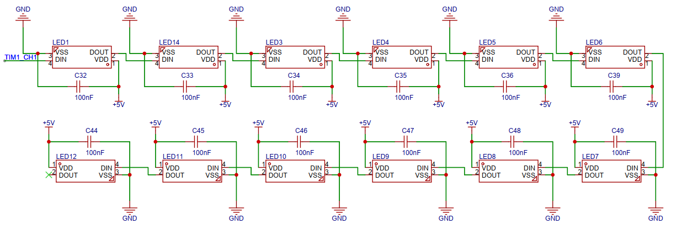
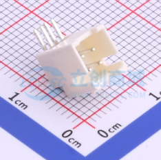
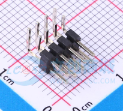
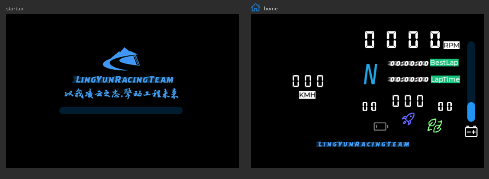
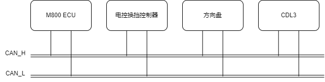
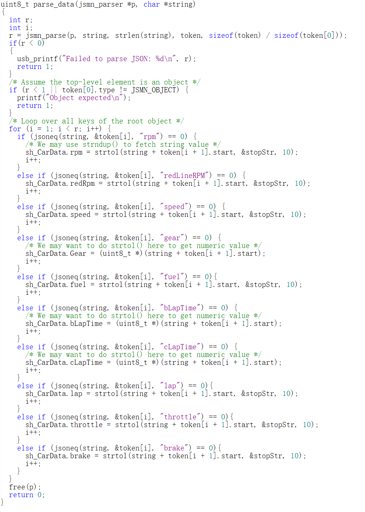
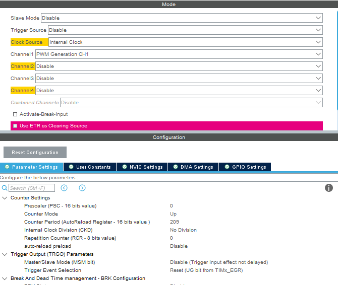
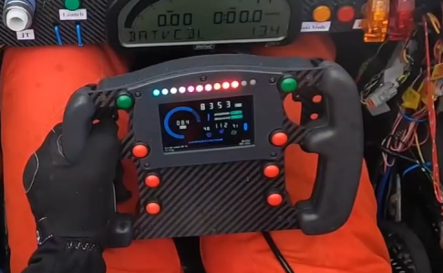
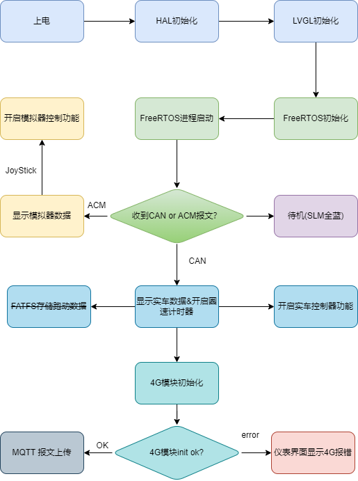

# LY streeringWheel MeterBox

# 关于本项目

本人的本科毕业设计，一款基于STM32F407的大学生方程式赛车方向盘，具体实现功能如下：

1. 采集整车跑动数据（实车模式）以及模拟器数据（模拟器数据），并在仪表上进行实时显示。
2. 通过4G网络，对实车的跑动数据进行实时上传，实现无线数据传输功能。
3. 能够对实车的跑动数据进行采集和保存，方便技术人员对跑动数据进行复盘和分析。
4. 实现控制器功能，能够控制如神力科莎（Assetto Corsa）、神力科莎：争锋（Assetto Corsa Competizione）、F1系列等模拟类赛车游戏。
5. 为了保证实车的可用性，需要具备高亮度的屏幕保证仪表在阳光下的可视效果。
6. 具备可编程按键，实时调整车辆状态。
   
实车使用效果：


模拟器使用效果：


本项目适用于[大学生方程式赛事](http://www.formulastudent.com.cn/)(👈戳我了解)，因此方向盘外形是依照大学生方程式赛事规则进行设计的。

功能上，实车模式开发基于[河北工程大学凌云车队](https://lingyun.site)(👈戳我了解)凌云Ⅸ号电动方程式赛车。

模拟器功能基于[神力科莎](https://store.steampowered.com/app/244210/Assetto_Corsa/)(👈戳我了解)进行测试。

硬件工程已完整开源在[嘉立创硬件开源平台](https://oshwhub.com/nolimy/steeringWheel_project)(👈戳我了解)，您可以通过该网址访问硬件工程。

项目视频请参考[bilibili](https://www.bilibili.com/video/BV1q24y1T7iM/)(👈戳我了解)

如果项目对您有所帮助，请帮忙点亮一个免费的STAR，开源不易，感谢支持！

---

# 关于开源协议

本项目是开源项目：你可以再分发之和/或依照由自由软件基金会发布的 GNU 通用公共许可证修改之，无论是版本 3 许可证，还是（按你的决定）任何以后版都可以。

发布该项目是希望它能有用，但是并无保障;甚至连可销售和符合某个特定的目的都不保证。请参看 GNU 通用公共许可证，了解详情。

你应该随程序获得一份 GNU 通用公共许可证的复本。如果没有，请看[https://www.gnu.org/licenses/](https://www.gnu.org/licenses/&gt;%E3%80%82)


---

# 关于结构设计

方向盘的外形和结构依照大学生方程式赛事规则进行设计：


---

方向盘盘体宽度为250mm，高度170mm。屏幕尺寸为3.5英寸。盘体正面有8个可编程控制器按键。背面安装两个换挡拨片。方向盘上壳体和下壳体使用碳纤维板进行CNC加工，其余零部件如握把、屏幕安装罩、方向盘边缘外壳、换挡拨片连杆及换挡拨片壳体使用黑色树脂进行3D打印加工。

另外设计了一个兼容罗技G27基座的方向盘转接器，所以在我的github仓库中出现了两个3D模型，一个是使用了实车的快拆器（4滚珠），一个是使用了连接到G27的3D打印的方向盘转接器。

BOM配料单请戳👉[我](https://github.com/Nolimy/steeringWheel_MeterBox_STM32_FreeRTOS/blob/main/Steering_Wheel_BOM.xlsx)

[https://github.com/Nolimy/steeringWheel_MeterBox_STM32_FreeRTOS/blob/main/Steering_Wheel_BOM.xlsx](https://github.com/Nolimy/steeringWheel_MeterBox_STM32_FreeRTOS/blob/main/Steering_Wheel_BOM.xlsx)

完整装配模型请戳（实车）👉[我https://github.com/Nolimy/steeringWheel_MeterBox_STM32_FreeRTOS/blob/main/Model/steeringWheel_2023_Release v13.step](https://github.com/Nolimy/steeringWheel_MeterBox_STM32_FreeRTOS/blob/main/Model/steeringWheel_2023_Release%20v13.step)

模拟器：👉[我https://github.com/Nolimy/steeringWheel_MeterBox_STM32_FreeRTOS/blob/main/Model/steeringWheel_2023_Simulator_For_G27 v3.step](https://github.com/Nolimy/steeringWheel_MeterBox_STM32_FreeRTOS/blob/main/Model/steeringWheel_2023_Simulator_For_G27%20v3.step)

3D打印服务推荐嘉立创旗下三维猴：[https://www.sanweihou.com/](https://www.sanweihou.com/), 三维猴提供在线报价，CNC加工，3D打印等一站式服务。

---

# 如何使用

方向盘分为三种模式：待机模式、实车模式和模拟器模式。方向盘上电后，默认为待机模式。当方向盘收到CAN报文，则为实车模式；当方向盘收到串口报文，则为模拟器模式。在待机模式下，电脑可以识别出方向盘为USB设备，但是手柄按键无响应，此时需要使用Simhub的自定义串口设备功能给方向盘发送串口报文，方可进入模拟器模式，模拟器模式手柄按键有响应。因此，使用模拟器模式需要同时使用simhub的自定义串口设备功能。

待机模式下，SLM（换挡LED模块）12颗LED灯珠全部为蓝色。

## 大学生方程式实车使用

方向盘默认使用的是125kbps的波特率，波特率可以使用CubeMX对波特率进行配置和修改，具体CAN协议请根据自家车队的实际情况，修改BSP/CAN中的代码。

## 模拟器使用

### 方向盘连接

模拟器使用需要配合[Simhub](https://www.simhubdash.com/)进行使用。将方向盘使用USB接口连接电脑后，电脑会识别出一个虚拟串口设备和控制器设备：


在“设置”中的“蓝牙和其他设备”中可以查看到方向盘的LY_Wheel_Controller外设。


在“设备管理器”中可以查看到方向盘的虚拟串口设备及其端口号。

方向盘控制器的校准，点击“蓝牙和其他设备”右侧的“设备和打印机”:


找到”LY_Wheel_Controller”，右键，点击 “游戏控制器设置”，然后点击“属性”.


在测试页中，可以对方向盘的按键进行测试。（默认待机模式下按下方向盘按钮是没有任何反应的）


### Simhub配置

方向盘的显示功能需要simhub配合使用，可以访问[https://www.simhubdash.com/](https://www.simhubdash.com/)下载simhub软件。这是一个非常强大的软件，支持多种模拟器游戏的数据采集，支持包括汽车仪表、arduino、G力座椅等多种外设。

安装好simhub后，打开设置界面：


点击插件功能：


打开”Custom serial devices“插件：


重新打开simhub后，左侧菜单中会出现”Custom Serial Devices”按钮：


根据设备管理器中显示的方向盘的[串口端口](https://www.notion.so/LY-streeringWheel-MeterBox-ad02f9fb1d354ffdb82a4e431bca5e7d)，选择serial port，我这里使用的是COM15。


添加游戏数据打包json脚本，将以下javaScript代码粘贴到”Uptate messages“中：

```jsx
function getCurrentLapTime(){
	var lapTime = $prop('CurrentLapTime');
	lapTime = lapTime.toString();
	if(lapTime == "00:00:00")
	{
		return lapTime;
	}
	else
		lapTime = lapTime.toString().slice(3,11);
	return lapTime;
}
function getRPM(){
	var rpm = $prop('DataCorePlugin.GameData.NewData.Rpms');
	rpm = format(rpm,"0");
	return rpm;
}
function getSpeed(){
	var speed = $prop('SpeedKmh');
	speed = format(speed, '0');
	return speed;
}
function getGear(){
	var gear = $prop('Gear');
	return gear;
}
function getBestLapTime(){
	var bestLapTime = $prop('BestLapTime');
	bestLapTime = bestLapTime.toString();
	if(bestLapTime == "00:00:00")
	{
		return bestLapTime;
	}
	else
		bestLapTime = bestLapTime.toString().slice(3,11);
	return bestLapTime;
}
function getFuel(){
	var fuel = $prop('FuelPercent');
	fuel = format(fuel, '0');
	return fuel;
}
function getRedLine(){
	var redLine = $prop('CarSettings_CurrentGearRedLineRPM');
	return redLine;
}
function getBrake(){
	var brake = $prop('Brake');
	brake = format(brake, '0');
	return brake;
}
function getThrottle(){
	var throttle = $prop('Throttle');
	throttle = format(throttle, '0');
	return throttle;
}
function getLap()
{
	lap = $prop('CurrentLap');
	return lap;
}
var speed = getSpeed();
var carData = "{\"speed\":" + getSpeed() + ",\"rpm\":" + getRPM() + ",\"cLapTime\":" +"\"" + getCurrentLapTime() + "\"," +"\"gear\":" + "\"" +getGear() + "\"" + ",\"bLapTime\":" +"\"" + getBestLapTime() + "\""+ ",\"fuel\":"+ getFuel() + ",\"redLineRPM\":"+ getRedLine()
  + ",\"brake\":" + getBrake() + ",\"throttle\":"+ getThrottle()  + ",\"lap\":"+ getLap() +"}";
return carData;
```

点击”Edit”:


点击”Computed value“：


勾选”Use JavaScript”:


将[代码](https://www.notion.so/LY-streeringWheel-MeterBox-ad02f9fb1d354ffdb82a4e431bca5e7d)粘贴到文本框中：


正常情况下Raw result中可以生成完整的json字符串。最后点击连接按钮，稍等片刻，就可以看到方向盘的SLM的全部蓝灯熄灭，此时进入模拟器模式。这时进行[手柄按键测试](https://www.notion.so/LY-streeringWheel-MeterBox-ad02f9fb1d354ffdb82a4e431bca5e7d)，可以看到按钮可以被正常检测到。


### 游戏内配置

以”Assetto Corsa“为例，在保证simhub后台运行的条件下，启动游戏。进入控制设置，将模拟器键位改成识别到的控制器按键键位，如下图：


接下来启动游戏，就可以拥有和实车方向盘一样的体验了。


# 目 录

[第1章 绪论](#绪论)

[1.1 课题研究的背景及意义](#11-课题研究的背景及意义)

[1.2 方向盘工作原理概述](#12-方向盘工作原理概述)

[1.2.1 方向盘机械结构](#121-方向盘机械结构)

[1.2.2 实车功能方案](#122-实车功能方案)

[1.2.3 模拟器功能方案](#123-模拟器功能方案)

[第2章 系统总体设计方案](#系统总体设计方案)

[2.1 硬件设计方案](#_Toc137138264)

[2.1.1 系统功能需求分析](#211-系统功能需求分析)

[2.1.2 硬件选型](#212-硬件选型)

[2.2 软件设计方案](#_Toc137138267)

[2.2.1 方向盘软件架构设计](#221-方向盘软件架构设计)

[2.2.2 MQTT服务器架构](#222-mqtt服务器架构)

[第3章 硬件开发设计及方案验证](#硬件开发设计及方案验证)

[3.1 STM32主控引脚资源分配](#31-stm32主控引脚资源分配)

[3.2 主机原理图设计](#32-主机原理图设计)

[3.2.1 STM32最小系统电路](#321-stm32最小系统电路)

[3.2.2 LCD屏幕驱动电路](#322-lcd屏幕驱动电路)

[3.2.3 BC260Y模块外围电路设计](#323-bc260y模块外围电路设计)

[3.2.4 CAN通信接口设计](#324-can通信接口设计)

[3.2.5 SLM LED电路](#325-slm-led电路)

[3.2.6 TYPE-C USB电路](#326-type-c-usb电路)

[3.2.6 其他接口电路](#326-其他接口电路)

[3.3 PCB Layout设计](#33-pcb-layout设计)

[第4章 STM32最小系统基础驱动配置](#stm32最小系统基础驱动配置)

[4.1 时钟配置](#41-时钟配置)

[4.2 STM32 SYS配置](#42-stm32-sys配置)

[4.3 数据交互层代码设计](#43-数据交互层代码设计)

[第5章 GUI仪表界面开发](#gui仪表界面开发)

[5.1 HAL层配置](#51-hal层配置)

[5.2 BSP层开发](#52-bsp层开发)

[5.3 APP层——LVGL开发](#53-app层lvgl开发)

[5.3.1 LVGL移植](#531-lvgl移植)

[5.3.2 LVGL界面设计](#532-lvgl界面设计)

[第6章 实车数据采集功能开发](#实车数据采集功能开发)

[6.1 CAN通信HAL层配置](#61-can通信hal层配置)

[6.2 CAN通信BSP层配置](#62-can通信bsp层配置)

[6.3 CAN APP层代码开发](#63-can-app层代码开发)

[第7章 模拟器相关功能实现](#模拟器相关功能实现)

[7.1 模拟器功能HAL层开发](#71-模拟器功能hal层开发)

[7.2 模拟器功能BSP层开发](#72-模拟器功能bsp层开发)

[7.3 模拟器相关功能APP层](#73-模拟器相关功能app层)

[第8章 无线数传功能开发](#无线数传功能开发)

[8.1 HAL层开发](#81-hal层开发)

[8.2 BC260Y BSP层开发](#82-bc260y-bsp层开发)

[8.3 BC260Y APP层开发](#83-bc260y-app层开发)

[8.4 无线数传测试](#84-无线数传测试)

[第9章 SLM功能模块开发](#slm功能模块开发)

[9.1 SLM HAL层开发](#91-slm-hal层开发)

[9.2 SLM BSP层驱动开发](#92-slm-bsp层驱动开发)

[9.3 SLM APP层开发](#93-slm-app层开发)

[第10章 总体功能整合](#总体功能整合)

[10.1 系统功能启动逻辑设计](#101-系统功能启动逻辑设计)

[10.2 FreeRTOS 进程配置](#102-freertos-进程配置)

[第11章 总结](#总结)

[11.1 方向盘机械结构设计](#111-方向盘机械结构设计)

[11.2 功能测试](#112-功能测试)

[11.3 待改进之处](#113-待改进之处)

[参考文献](#参考文献)

[致 谢](#致-谢)

# 绪论

## 1.1 课题研究的背景及意义

中国大学生方程式系列赛事（Formular Student China）（简称“FSC”）是一项由高等院校汽车工程或汽车相关专业在校学生组队参加的汽车设计与制造比赛。各参赛车队按照赛事规则和赛车制造标准，在一年的时间内自行设计和制造出一辆在加速、制动、操控性等方面具有优异表现的小型单人座休闲赛车，能够成功完成全部或部分赛事环节的比赛。中国大学生方程式系列赛事包括四个分赛项：中国大学生方程式汽车大赛（燃油车）、中国大学生电动方程式大赛、中国汽车工程学会巴哈大赛以及中国大学生无人驾驶方程式赛事。[1]迄今为止，我国参加FSC赛事的参赛队伍已经有超过100多支，该赛事为我国汽车工业输送了大批优秀人才，是汽车工程师的摇篮。


中国大学生燃油方程式赛车是指使用以汽油作为动力的单座小型休闲赛车。参赛车队根据赛事规则设计并制造赛车，并进行一系列的动态跑动测试，包括直线加速、八字环绕、高速避障和耐久测试。如图1-2为河北工程大学凌云车队2020赛季参赛油车——凌云Ⅷ号赛车。该赛车搭载凯旋675发动机，使用MoTeC M800作为ECU对发动机进行自主标定和控制。该赛车使用了机械增压装置、电动离合、气动换挡、无线数传系统等设计。

中国大学生电动方程式赛车是使用电力作为动力来源的方程式赛车，如图1-3为凌云车队在2022赛季参赛的凌云Ⅸ号电动方程式赛车，该赛车使用两个EMRAX208高压轮边电机作为动力总成，使用自行设计的额定电压为444V的高压电池作为动力来源，峰值功率为150kW，最大转速为6000RPM，设计最高车速为120km/h。

|  图12 凌云Ⅷ号燃油方程式赛车 |  图13 凌云Ⅸ号电动方程式赛车 |
|-----------------------------------------------------------------------------|-----------------------------------------------------------------------------|

在大学生方程式赛事中，各家车队使用的数据采集系统主要分为两种，一种是使用与MoTeC ECU相配套的MoTeC官方赛用仪表，如CDL3、C125等，这类仪表功能强大，具备有数据采集、数据显示、数据分析等功能，但价格普遍偏贵，市场价在2\~3万元人民币不等；另外一种是使用车队自制的仪表系统，这类仪表大都是使用普通的如LCD1602液晶显示器作为屏幕，显示效果差，但成本很低，开发难度不高。如图1-4为MoTeC的CDL3仪表，图1-5为北京理工大学使用的自制仪表屏幕面板。

|  图14 MoTeC CDL3仪表 |  图15 北京理工大学自制仪表面板 |
|---------------------------------------------------------------------|--------------------------------------------------------------------------------|

而在更高级别的方程式赛事中，例如F1、F2方程式赛事等，这些赛车的数据采集系统是集成在方向盘上的，绝大多数赛车的方向盘作为一个独立的终端被集成在赛车中，对车辆的跑动数据进行采集，同时方向盘上的按钮可以实时控制车辆功能，例如改变当前的跑动策略，甚至与维修区的工程师进行实时通信，这就要求方向盘不但具备有基础的控制车辆转向的功能，同时可以作为一个数据采集的终端，收发车辆的数据。在为车手反馈车辆跑动状态的同时，还能够将采集到的数据实时打包发送给P房的策略师和工程师，对车辆的状态进行实时监控。如图1-6为法拉利F1车队的方向盘盘面。


图16 法拉利F1方程式赛车方向盘

国外一些大学生方程式车队已经采用了类似上述F1方程式赛车的方向盘设计方案，将数据采集系统集成在方向盘内部，以达到更高的集成度。如下图为波兰的Wroclaw University of Technology大学生方程式赛车队PWR Racing Team的RTⅩ赛车设计并制造的使用集成数据采集系统和仪表显示的方向盘，该系统采用了自行设计的硬件系统，通过接入到赛车的整车CAN网络，对行车电脑的数据进行解算后将数据显示到屏幕。


图17 PWR RTⅩ' s Steering Wheel

动态项目作为大学生方程式系列赛事中不可或缺的比赛方式，其对车手的驾驶技能要求很高。因此，车手的日常训练就显得尤为重要。由于实车训练会导致资源消耗，如轮胎磨损、燃油消耗、场地限制等，同时具有一定危险性，因此实车训练虽然重要但是成本比较高，实际在日常练车中频率较低，车手训练更多采用的方式是使用驾驶模拟器进行训练。模拟器技术是由汽车的线控底盘技术演变而来，具备有换挡拨杆、手刹器、踏板、伺服电机转向基座等装置，基于计算机模拟技术，通过将专用的控制器接入到计算机，与相应的模拟软件配合，即可达到模拟实车驾驶跑动的目的。如下图1-8为F1方程式车手训练时使用的模拟器设备。对于大学生方程式赛事，更多车队使用的模拟器设备如图1-9所示，相较于F1等高级别方程式车手训练所使用的设备来说略显简陋，但是能达到拟真实车跑动驾驶体验的目的，对车手驾驶技能的训练有显著的提升作用。

|  图18 红牛F1车队模拟器装置 |  图19 国内市场上某品牌直驱模拟器产品 |
|---------------------------------------------------------------------------|-------------------------------------------------------------------------------------|

模拟器软件方面，国内大学生方程式车队中被广泛使用的模拟软件是由意大利游戏开发商Kunos Simulazioni开发的《神力科莎》（意大利语：Assetto Corsa, 英语：“Racing Setup”），如图1-10为该软件的画面。这款游戏的定义是“赛车模拟器”，通过激光扫描赛道与细致的物理引擎还原各种公路车型和赛道车型提供逼真的驾驶体验。游戏支持一系列外设，包括键鼠、游戏手柄、方向盘模拟器装置。为保证逼真的拟真体验，车手训练时会使用方向盘模拟设备使用该软件。一个很有特色的功能在于，游戏中的HUD可以通过扩展外设的方式扩展到计算机以外的其他硬件，如模拟器方向盘的屏幕上能够显示当前模拟器软件中车辆跑动的实车状态，相当于形成了一个真实的仪表。如图1-11为模拟器方向盘的仪表显示模拟器的车辆跑动数据。

|  图110 神力科莎模拟F1方程式赛车跑动 |  图111 方向盘显示模拟器跑动数据 |
|------------------------------------------------------------------------------------|--------------------------------------------------------------------------------|

综上，在大学生方程式系列赛事中，实车上使用的仪表和数据采集系统可以借鉴更高级别方程式赛车的设计思路，将其整体集成在方向盘内部，使方向盘不再仅仅是一个用于转向的工具。而模拟器上常见的带有仪表显示功能的方向盘，其外形和功能上与实车的方向盘基本一致，因此可以考虑将方向盘设计成实车和模拟器相互兼容的设备，在大学生方程式的车手日常训练时，使用同一块方向盘进行实车和模拟器的训练，对实车和模拟器的数据分别进行采集和显示。

基于上述几种当前赛场上常见的数据采集系统，本项目旨在设计一款低成本、兼容性强、功能强大、集成在方向盘中的仪表系统，具备有数据采集、仪表显示、无线数据传输等功能。同时兼容大学生方程式实车和模拟器设备。具体功能描述如下：

（1）采集大学生方程式系列赛事赛车的实车跑动数据（实车模式）以及模拟器数据（模拟器模式），并在仪表上进行实时显示。

（2）通过4G网络，对实车的跑动数据进行实时上传，实现无线数据传输功能，工程人员可以通过上位机查看赛车的实时跑动状态。

（3）实现控制器功能，能够对如神力科莎、神力科莎：争锋、F1系列模拟类赛车游戏。

（4）为保证实车在阳光下的仪表可视条件，需要具备高亮度仪表保证良好的显示效果。

（5）具备可编程按键，能够对实车功能进行控制，如进行车辆的换挡、ABS调节等功能。

（6）具备换挡提示灯条，即根据当前发动机转速提示车手进行升档降档操作的灯条。英文称之为Shift LED Module(SLM)。

## 1.2 方向盘工作原理概述

### 1.2.1 方向盘机械结构

机械结构设计主要依据《中国大学生方程式大赛规则-2022》中对转向结构及方向盘形状的规则进行设计。规则中要求：“方向盘轮廓必须为连续闭合的近圆形或近椭圆形。例如：方向盘的外轮廓可以有一些部分趋向直线，但不可以有内凹的部分。禁止使用 H 形、8 型或外轮廓有开口的方向盘。”同时规则中还要求方向盘在任何转角下的最高点都不能高于方程式赛车前环的最高点，这是对车手手部安全的保护。但由于驾驶舱内空间狭小，若是方向盘太大、太低，可能会和车手的大腿发生干涉；如果方向盘太小又可能导致车手在转向时更加费力。所以需要在多个条件限制下找到最适合的方向盘尺寸和定位设计方案。参考其他级别方程式赛车的盘面设计，采用带圆角的长方形。如下图1-12为河北工程大学凌云车队在2019赛季使用的方向盘轮廓设计。


图112 凌云车队2019赛季方向盘

在制作工艺上可以选择复合材料或是3D打印来进一步轻量化。在车手握方向盘的地方可以添加手模，或是缠绕增加摩擦力的纱布，便于车手握紧方向盘。参考美国艾克朗大学ZIPS Racing方程式赛车队2019\~2020赛季的设计报告[2]，方向盘可以采用三明治结构进行设计，使用3D打印技术和CNC技术进行制造，其中，握把使用FDM 3D[3,4]打印技术进行制造，方向盘使用碳纤维板进行CNC切割。方向盘必须由坐在驾驶座上的人快速卸下，无需使用工具，因此需要通过在转向柱末端处焊接一个快速释放花键来完成，这个花键与安装在方向盘背面的一个快拆器配合使用。快拆器可以选型购买市面上常见的方程式赛车快拆器，只需在方向盘主体上依照快拆器安装螺栓位置预留好安装孔位即可。为了保证轻量化设计，方向盘主体可以进行镂空，为了保证镂空后的方向盘强度，需要对镂空后的方向盘模型进行有限元受力分析，保证方向盘轻量化设计的同时具备足够的强度。

### 1.2.2 实车功能方案

实车功能上主要分为数据采集、数据显示、车辆控制、无线数传功能四部分。其中数据采集是所有功能的基础。数据采集方面，方向盘通过CAN接口接入到整车CAN网络，通过接收并解析整车控制器或ECU在CAN网络中广播出来的特定CAN报文，即可获取到实车跑动数据，如车速、电机或发动机转速、节气门开度、踏板开度等。将采集到的CAN报文解析成物理数值后，主控芯片将相关数据渲染到仪表界面，实现数据显示功能[5.6]。车辆控制功能通过在方向盘盘面预留出按键，主控芯片通过GPIO读取按键状态，将控制信号转为CAN信号发送到CAN网络，整车控制器或者其他CAN网络中的控制单元接收相应的CAN报文进行相应功能的响应。无线数传基于4G模块，将采集的车辆跑动数据打包好通过MQTT协议发送到云端服务器实现无线数传功能。

### 1.2.3 模拟器功能方案

模拟器功能相对实车功能比较简单，通过USB将方向盘连接到电脑，方向盘作为复合USB设备，电脑将方向盘识别成两个USB设备，分别是虚拟串口和joystick控制器设备。通过Simhub软件将模拟赛车软件中的跑动数据打包成json报文从虚拟串口发送给方向盘，方向盘将解析后的跑动数据渲染到仪表界面。控制器功能基于joystick USB设备，通过编写USB的设备描述符，将方向盘的按钮开关信号采集后通过USB发送给电脑，即可实现模拟器的控制器功能。

# 系统总体设计方案

## 2.1 硬件设计方案

依据预期设计目标，该方向盘主要接收和发送CAN报文以及USB虚拟串口报文，因此需要基础的CAN收发电路和USB TypeC接口；同时使用4G模块上传数据，需要设计单独的4G模块电路；保存跑动数据到FLASH，所以需要外部FLASH的外围电路；仪表显示则需要基础的屏幕驱动电路；同时需要对实车和模拟器进行基础的控制，故需要按键电路；其他的还包括基于WS2812B LED的全彩换挡提示模块（Shift LED Module,，简称SLM），以及主控芯片基础的外围电路如晶振电路和供电电路等[7]。

如图2-1为系统总体框图。


图21 系统总体框图


图22 硬件系统框图

### 2.1.1 系统功能需求分析

需要实现方向盘在接收到实车或者模拟器电脑发送的CAN数据或串口数据后，能够将解析好的物理数值如车速、发动机转速等渲染到屏幕上，同时在实车模式下将采集好的车辆跑动数据通过4G模块发送到云端方便其他人员查看实时跑动状态，并将数据保存到外部FLASH。方向盘具备控制功能，需要通过采集按键信号，发送相应的控制指令给车辆和模拟器。另外有独立的SLM模块能够依据当前发动机转速提示车手进行升档降档操作。

### 2.1.2 硬件选型

主控的选型，根据以上分析方向盘所涉及到的功能，我们需要主控同时具备有如下外设接口：给LCD屏幕使用的FSMC接口、与4G模块通信的至少1路的USART接口、与外部FLASH通信的SPI接口、至少1路CAN控制接口、至少3路可编程定时器、足够的GPIO接口、支持全速USB功能接口。同时为了保证仪表的显示效果，主控需要处理大量的图形界面相关的运算，因此需要至少128KB的RAM，同时为保存图片字体等图形资源，FLASH也需要足够大。主控的主频直接决定了仪表的运行效果，因此选型的主控需要有足够高的运行频率。如图2-3为本项目所使用到的所有外设接口图。


图23 方向盘外设接口框图

除了主控需要具备有相应的外设资源和优异的性能以保证功能的实现，还要考虑到经济性，尽量选择价格低、货量充足的芯片作为我们的主控。最终我们选择了STM32F4系列的STM32F407ZET6，其具备有192KB RAM，512KB 片上FLASH，以及168MHz的时钟运行频率，该芯片为LQFP144封装，具备有足够本项目使用的GPIO外设接口，同时该封装便于手工焊接和贴片焊接。如图2-4为STM32F407ZET6芯片。


图24 STM32F407ZET6

4G模块上，我们选择上海移远通信的BC260Y模块，该模块支持多种网络协议：UDP/TCP/MQTT，同时具备有AT命令功能的串口，方便与主控进行通信。同时该模块能够接入到阿里云等物联网云平台，具有很强的可扩展性。

|  图25 BC260Y-CN |  图26 BC260Y引脚分配图 |
|----------------------------------------------------------------|-----------------------------------------------------------------------|

LCD屏幕选型方面，基于方向盘尺寸的考虑，我们选择使用3.5inch的屏幕。为了保证仪表在阳光直射条件下依然有良好的可视效果，市面上常见的屏幕很难满足高亮度可视需求，因此我联系到了屏幕供应商柯达科，他们提供了一款亮度可以达到1000尼特的LCD屏幕。其屏幕型号为KD035HVFMD145-01，通信协议支持SPI及8080协议。其主要参数如表2-1所示：


图27 该屏幕在阳光下的显示效果

表21 KD035HVFMD145-01

| 主控   | 材质 | 亮度     | 色彩     | 分辨率   | 尺寸    | 供电电压 |
|--------|------|----------|----------|----------|---------|----------|
| ST7796 | TFT  | 950cd/m2 | 65K/262K | 480\*320 | 3.5inch | 3.3V     |

CAN收发器的选型上，经过综合价格、性能、供货速度等因素考量[8,9]，我采用了TJA1050芯片作为方向盘的CAN收发器。TJA1050的主要特征如下：

（1）完全符合ISO 11898标准。

（2）最高速率可达到1Mbit/s，完全符合大学生方程式赛车的CAN网络的波特率要求。

（3）电磁辐射极低，同时具备有很强的电磁抗干扰性能。

（4）保护总线引脚，防止汽车环境中的瞬态干扰。

（5）STM32的CAN控制接口为3.3V电压，赛车CAN网络为5V，TJA1050具备输入级和3.3V以及5V 的器件兼容能力。

（6）防止电池对地的短路。

SLM模块和仪表屏幕一样需要满足在阳光下可视的要求，因此选型使用WS2812B作为SLM模块的显示元件，其峰值亮度可达到1200尼特。这款LED使用PWM进行控制，仅需一个控制引脚即可实现多个LED的串联控制，具体特点如下：

（1）IC控制电路与LED点光源共用一个电源。

（2）控制电路与RGB芯片集成在一个5050封装的元器件中，构成一个完整的外控像素点。

（3）内置信号整形电路，任何一个像素点收到信号后经过波形整形后输出，保证线路波形畸变不会累加。

（4）内置上电复位和掉电复位电路。

（5）每个像素点的三基色可实现256级的亮度显示。完成16777216种颜色的全真色彩显示。

（6）端口扫描频率为2KHz/s。

（7）串行级联接口，能通过一根信号线完成数据的接收与解码。

（8）数据发送速度可达800Kbps.


图28 WS2812B典型应用电路


图29 WS2812B实物

外部FLASH选用华邦的W25Q128芯片，其具有16Mbytes的容量，可以存储大约1\~2h的实车跑动数据。该芯片使用SPI与STM32主控进行通信，同时其封装可以与华邦其他同系列的不同容量芯片相同，在保证外部电路和封装不变的情况下更换其他容量FLASH芯片十分便捷。


图210 W25Q128JVSIQ

综上所述，具体的硬件架构如下图所示：


图211 详细的硬件架构图

## 2.2 软件设计方案

软件上主要分为基于方向盘硬件的固件、无线数传所使用的MQTT服务配置以及相应的无线数传上位机开发。

### 2.2.1 方向盘软件架构设计

基于方向盘的硬件设计以及要实现的功能，我们的软件架构选择垂直结构，考虑到方向盘要实现的功能比较复杂，且实时性要求较高，因此在软件上使用到了嵌入式实时操作系统FreeRTOS，通过实时操作系统的任务进程管理，将需要同时运行的功能任务分成多个进程，分时运行。如下图2-11为系统整体架构：


图212 系统整体架构

软件层主要分为HAL（硬件抽象层）、Database（数据层）、BSP层（板级支持包）、

APP层（应用层）、操作系统。

HAL层代码通过ST意法半导体公司官方的MCU图形化配置工具生成，通过图形化界面配置好项目中使用到的外设，如串口、SPI、CAN等外设，即可生成相应的驱动代码。以串口为例，我们可以在图形界面中使能串口功能，并配置硬件控制流、中断、DMA，以及基本的波特率、字长、停止位等设置。配置完成后通过GENERATE CODE按钮即可生成相应的C代码。


图213 CubeMX串口配置页面

Database层中定义了上层应用中所使用到的所有变量和常量定义，其作用是为了避免变量的重复定义与.h头文件的重复引用和声明，使代码结构清晰，同时便于变量内存的管理，增强代码的可维护性和可读性。

BSP层是根据HAL层提供的硬件接口代码编写的，是沟通HAL层和APP层的桥梁，其作用是将APP层和HAL层分隔开，避免APP层直接调用HAL层代码，增强代码的可移植性。根据功能需求，BSP层有以下模块构成：

（1）BSP_W25Q128：对应硬件上的外部FLASH W25Q128芯片，主要调用HAL层的SPI相关代码，实现FLASH的读写操作，为APP层的FATFS提供相应的接口代码。

（2）BSP_BC260Y：对应硬件上的4G模块 BC260Y模组，主要调用HAL层的USART相关代码，实现BC260Y初始化、连接网络、错误回调等功能，为APP层的MQTT应用提供接口代码。

（3）BSP_CAN：对应硬件上的CAN收发器TJA1050，主要调用HAL层的CAN相关代码，实现CAN接收中断、CAN滤波器初始化等功能，为APP层的LY_CAN报文解析协议应用提供接口代码。

（4）BSP_USB：对应硬件上的USB接口，硬件上使用TYPEC接口连接计算机。主要调用HAL层的USB相关代码，实现USB的复合设备功能，如ACM虚拟串口接收中断、JoyStick的按键等功能，为APP层的Simhub应用提供接口代码。

（5）BSP_LCD：对应硬件上的LCD显示屏，主要调用HAL层的FSMC相关代码，基于8080协议，与LCD主控进行通信，进行基本的读写操作，提供有相应的屏幕亮屏、初始化、画点、画线等功能，为APP层的LVGL图形库提供接口代码。

（6）BSP_WS2812B：对应硬件上的WS2812B LED模块，主要调用HAL层的TIM向相关代码，基于定时器DMA输出可变的PWM波形，控制WS2812B模块的显示颜色，提供有基本的点灯函数和WS2812B的颜色控制函数，为APP层的SLM功能提供基础的接口代码。

（7）Usart_Printf：对应主控上的三路Usart，主要调用HAL层的USART相关代码，定义了printf重定向函数，方便进行项目调试，为所有APP层的模块提供printf输出接口，便于Debug。

APP层为应用代码层，定义了所有功能的具体实现的逻辑代码。为FreeRTOS系统提供接口函数。FreeRTOS的进程代码中直接调用APP层封装好的函数，如MQTT打包上传函数，SLM转速响应函数等。

FreeRTOS对APP层定义的所有功能进行统筹规划，通过FreeRTOS的进程管理，保证方向盘所有功能稳定运行。

综上所述，具体的软件架构图如下图所示：


图214 软件架构图

### 2.2.2 MQTT服务器架构

基于选用的4G模块BC260Y所支持的TCP/UDP/MQTT网络协议，综合稳定性、可维护性和成本上的考虑，选择使用MQTT（Message Queuing Telemetry Transport）协议作为无线数传的传输协议。MQTT协议是基于TCP/IP协议上为硬件性能低下的远程设备设计的基于客户端-服务器的消息发布/订阅传输协议，其特点是轻量、建议、开放，被广泛应用于物联网(IoT)设备之间的通信。其工作原理大概理解如下：

MQTT协议基于“发布-订阅”模型，其中包括两个角色，发布者（Publisher）和订阅者（Subscriber）。发布者负责发送消息，订阅者则负责接收感兴趣的消息。比如一个非常简单的使用场景：房间里有一个温度传感器，用户需要从远程获取到房间中的温度，则可以将温度传感器配置为MQTT的发布者，并定期发布当前温度的消息，而用户的手机或者电脑作为MQTT的订阅者，订阅温度消息，用户即可得到房间某时某刻的温度信息。

MQTT服务器架设在阿里云的Linux操作系统的轻量型应用服务器上，作为服务的形式不间断运行在服务器的进程中。

上位机使用QT5和C++进行编写，通过移植并调用QT官方提供的MQTT库，编写MQTT的订阅函数，完成上位机对车辆跑动数据的接收和解析显示。

# 硬件开发设计及方案验证

## 3.1 STM32主控引脚资源分配

根据功能需求，使用STM32 CubeMX图形化配置软件为STM32F407ZET6的引脚资源分配如下图所示：


图31 STM32F4芯片引脚分配

根据分配好的引脚导出的Symbol如下图所示：


图32 STM32F407ZET6 Symbol

## 3.2 主机原理图设计

使用嘉立创的国产EDA设计软件：嘉立创EDA（专业版）进行主机原理图的绘制和PCB设计。

### 3.2.1 STM32最小系统电路

STM32F407ZET6芯片的最小电路包括：供电电路、HSE晶振电路、LSE晶振电路、ST-Link下载电路、复位电路。

STM32F407ZET6使用3.3V进行供电，但方向盘整体硬件系统使用5V进行供电，因此需要一路低压差线性稳压器（Low Dropout Regulator）将5V降压为3.3V，在这里使用到了AMS1117线性稳压器，其整体电路如图3-3所示：


图33 STM32主控供电电路

根据STM32F407ZET6的数据手册的推荐HSE电路和LSE电路，我们分别选择使用8MHz的无源晶振和32.768KHz的无源晶振，并绘制原理图如下：

|  图34 HSE电路 |  图35 LSE电路  |
|--------------------------------------------------------------|---------------------------------------------------------------|

官方提供的ST-Link下载电路引脚较多，默认是使用牛角插座的封装形式，这样的封装非常占用PCB的控件，因此，我将官方提供的参考电路进行了一定简化，删除了不必要的引脚，仅保留主要的信号引脚和复位引脚，这样就节省了PCB的空间，使PCB更小。经过简化后的ST-Link下载调试电路如图3-6所示。

STM32系列芯片复位功能是将相应的GPIO引脚拉低0.5\~3ms左右的时间，即可对芯片重启。根据官方提供的复位电路参考案例，绘制复位电路如图3-7.

|  图36 简化后的下载电路 |  图37 复位电路 |
|-----------------------------------------------------------------------|---------------------------------------------------------------|

### 3.2.2 LCD屏幕驱动电路

屏幕驱动电路主要包括三部分：供电电路、屏幕背光电路、主控通信电路。其中，为了保证屏幕工作的稳定性，其供电的3.3V使用独立的LDO进行供电，其供电电路与图3-3相同，不再赘述。

使用的型号为KD035HVFMD145-01的屏幕主控型号为ST7796，与主控STM32的通信方式有SPI和8080两种方式。其中，SPI为三线信号传输，8080支持16线信号传输。ST7796的控制方式由IM0、IM1、IM2三个管脚决定，如下表格为ST7796的控制方式定义。

表31 ST7796控制方式

| IM2 | IM1 | IM0 | 控制方式   |
|-----|-----|-----|------------|
| 0   | 0   | 0   | 18Bit 8080 |
| 0   | 0   | 1   | 9Bit 8080  |
| 0   | 1   | 0   | 16Bit 8080 |
| 0   | 1   | 1   | 8Bit 8080  |
| 1   | 0   | 1   | 3-Wire SPI |
| 1   | 1   | 1   | 4-Wire SPI |

因为使用更多的传输线进行数据传输能够增加带宽，提高屏幕的显示效果，因此我们使用16Bit的8080协议进行通信控制。使用STM32的FSMC功能，即可对8080协议进行模拟。因此与屏幕通信的电路如图所示。

这款屏幕的背光为屏幕背光为10颗LED灯珠，可以提供1000尼特的亮度，保证在户外阳光直射下的良好显示效果。其最大驱动电流为40mA，驱动电压为16V，因此需要使用Boost升压电路，将3.3V电压升压为16V。如图为根据厂家提供的设计参考改进的背光驱动电路。

|  图38 LCD控制电路 |  图39 背光驱动电路  |
|------------------------------------------------------------------|--------------------------------------------------------------------|

### 3.2.3 BC260Y模块外围电路设计

BC260Y与STM32主控芯片通过串口进行通信。其主要的外围电路包括：独立的3.3V供电电路、串口电平转换电路、开机复位电路、USIM卡座电路、天线电路。其中3.3V的与上文使用相同方案，即整体电路中一共使用了三路LDO将5V转为3.3V分别给三个不同的模块供电，这里不再赘述。其他电路的设计主要参考移远通信官方提供的硬件设计参考方案，如图3-10所示。


图310 BC260Y参考电路

由于模块的串口电压域为1.8V，而STM32主控的电压域为3.3V，则需在模块和STM32主控之间增加电平转换器，这里我们选择德州仪器的 TXS0108EPWR双向电平转换器，该转换器最高数据速率为60Mbps，具有8个通道，能够满足我们的应用需求。具体电路如图3-11所示。

|  图311 电平转换电路 |  图312 德州仪器TXS0108EPWR |
|--------------------------------------------------------------------|---------------------------------------------------------------------------|

模块的开机复位电路使用STM32主控的GPIO进行控制，官方推荐使用开集驱动电路来控制RESET引脚。模块上电后，保持RESET及BOOT（即PWRKEY引脚）输入不被拉低，即可实现模块自动开机，开机时序如图3-13所示。

依据官方提供的参考电路，MCU与模块之间的开机和复位控制电路如图3-14所示。

|  图313 BC260Y开机时序 |  图314 开机电路和复位电路 |
|----------------------------------------------------------------------|--------------------------------------------------------------------------|

USIM卡座电路基于官方提供的参考电路进行设计，外部USIM卡通过模块内部的电源供电，不额外供电，支持1.8/3.0V供电。为了确保良好的ESD防护性能，应当加入ESD保护器件，外部USIM卡座信号走线应从USIM卡座连接到ESD保护器件后再从ESD保护器件连接到模块。完整的电路设计如图。


图315 USIM卡座电路

天线电路如下图所示：


图316 天线电路

### 3.2.4 CAN通信接口设计

STM32主控的CAN_Tx和CAN_Rx引脚与CAN收发器TJA1050的TXD和RXD引脚对应连接，并在CAN_H和CAN_L之间添加120欧姆电阻做CAN总线的阻抗匹配，以保证CAN通信的稳定性。除此之外，TJA1050应使用5V进行供电，在其VCC和GND之间增加100nF电容做滤波。


图317 CAN通信接口设计电路

### 3.2.5 SLM LED电路

SLM模块使用了WS2812B这款LED，其内部集成了处理芯片和3颗不同颜色的LED灯（红，蓝，绿），通过使用单总线协议分别控制不同颜色的亮度强弱，达到全彩显示的目的。每一个灯需要1字节的数据，故一颗WS2812B需要24Bit（3Bytes）的数据。可以采用PWM的方式进行编码，即每个PWM的周期固定为1.25us（800K），占空比为1/3时为0码，占空比为2/3时为1码。WS2812B可以将多个灯珠串联起来，通过一个总线进行控制，将多个灯珠串联后的组合视为队列，在数据传输过程中，前面的灯珠可以将前24Bit的数据留存并解析，剩余的其他数据截断后通过单总线发给线下一个灯珠。使用STM32进行控制可以使用SPI或者TIM/DMA输出PWM的方式进行控制。在本项目中我是用TIM/DMA的方式对WS2812B进行驱动，使用STM32的TIM1定时器的通道1作为信号线对WS2812B进行控制。

SLM模块的作用是根据发动机转速或者电机转速提示车手进行升档降档操作。因此，其灯珠亮灭的个数与发动机转速有关。经过基于成本以及电路驱动能力的考虑，SLM模块使用12颗WS2812B灯珠，其电路如下图所示。



图318 WS2812B电路

### 3.2.6 TYPE-C USB电路

方向盘需要通过USB线缆连接电脑，接收模拟器数据并对模拟器游戏里的车辆进行控制。USB是通用串行总线，是一种快速、灵活的总线接口，硬件上使用D+和D-两个差分信号线进行数据传输。STM32F4系列芯片支持高速USB（USB_OTG_HS）和全速USB（USB_OTG_FS），USB_OTG_HS速率最高为480M Bit/s，但此时需要外接USB HS PHY。USB_OTG_FS最高为12M Bit/s，即1.5Mbytes/s，基本满足项目需求。USB接口选择使用Type-C接口，电路设计如图3-19所示。


图319 USB电路设计

图3-19中，R12和R13两个22欧姆的电阻是高速信号线的终端电阻，其作用是为了阻抗匹配，防止信号回波反射，也有一定的抗击电流的作用。USB_FS_DP管脚处的1.5k欧姆电阻是当设备接入到主机后会被主机识别为全速USB设备。D7为一个ESD芯片，为了防止USB受到雷击或者静电损坏主芯片。

### 3.2.6 其他接口电路

方向盘接入实车和模拟器需要使用线束连接，因此需要预留出线束连接的接插件接口电路。需要预留出的接口线束定义如下表所示：

表32 线束接口定义

| 定义      | 描述          | 类型       |
|-----------|---------------|------------|
| INPUT8    | 按键输入接口8 | 开关量输入 |
| INPUT7    | 按键输入接口7 | 开关量输入 |
| INPUT6    | 按键输入接口6 | 开关量输入 |
| INPUT5    | 按键输入接口5 | 开关量输入 |
| INPUT4    | 按键输入接口4 | 开关量输入 |
| INPUT3    | 按键输入接口3 | 开关量输入 |
| INPUT2    | 按键输入接口2 | 开关量输入 |
| INPUT1    | 按键输入接口1 | 开关量输入 |
| INPUT9    | 按键输入接口9 | 开关量输入 |
| INPUTA    | 按键输入接口A | 开关量输入 |
| CAN_H     | CAN高         | 通信接口   |
| CAN_L     | CAN低         | 通信接口   |
| USB_FS_DP | USB信号线正   | 通信接口   |
| USB_FS_DM | USB信号线负   | 通信接口   |
| 5V        | 5V输入        | 电源接口   |
| GND       | 地            | 电源接口   |

将以上线束的接插件进行分组，INPUT1\~INPUT8接口为一组，INPUT9和INPUTA作为换挡拨片开关接口为一组，CAN_H、CAN_L、USB_FS_DP、USB_FS_DM、5V、GND为一组，选型接插件如下图3-20、图3-21、图3-22所示。

|  图320 一组按键接口16PIN接插件 |  图321 二组按键接口4PIN接插件 |  图322 6PIN接插件  |
|-------------------------------------------------------------------------------|------------------------------------------------------------------------------|-------------------------------------------------------------------|

电路原理图如下图所示。


图323 接插件电路原理图

另外预留出Debug接口，如STM32主控芯片的下载调试接口，以及串口电路，方便后期开发过程中进行调试和Debug。选型接口和电路图如下图所示。

|  图324 PZ200-2-04-W |  图325 Debug接口电路 |
|--------------------------------------------------------------------|---------------------------------------------------------------------|

## 3.3 PCB Layout设计

原理图设计完成进行DRC检查后将原理图转化到PCB，对PCB进行设计。由于实现功能复杂，为了简化布线布局难度，因此PCB使用四层板，从上到下依次为顶层、内层1、内层2、底层，其中顶层、底层和内层1走信号线，内层2走电源线。最终硬件Layout如下图所示。


图326 PCB Layout


图327 PCB 2D图

使用嘉立创EDA生成PCB的3D预览图如下图。


图328 PCB 3D效果图

PCB上使用到的容阻感原件全部使用0805封装，方便手工使用烙铁进行焊接。经过嘉立创打样后进行焊接，硬件实物如下图。


图329 PCBA实物

经过测试，硬件功能基本正常。

# STM32最小系统基础驱动配置

使用ST官方的STM32 CubeMX图形化代码生成工具对软件上的基础硬件驱动代码进行编写。本章节使用到的全部代码基于STM32官方HAL库。本章节主要介绍本项目中STM32主控固件的HAL层代码设计，包括STM32时钟配置、STM32 SYS模块配置以及数据交互层开发。

## 4.1 时钟配置

STM32的基础硬件配置包括RCC晶振时钟树配置、SYS配置。由于STM32芯片内部自带的时钟（HSI和LSI）在实际工程上使用会导致较大的晶振误差，导致如CAN、USB等需要进行高速通信的外设工作异常，因此我们需要将STM32的默认时钟改为使用外部晶振，来保证功能稳定。硬件上我们使用了8MHz的无源晶振，在STM32 CubeMX的时钟配置RCC菜单中选中时钟源后，将HSI改为HSE，并将晶振频率配置为168MHz，及使芯片在最高频率下运行。时钟树配置如图4-1所示。


图41 STM32 时钟树配置

## 4.2 STM32 SYS配置

为了避免ST-Link下载和Debug功能管脚占用，工程中我们应当在SYS设置中将Debug模式打开选择使用Serial Wire功能。使能Debug后，STM32芯片上的PA13和PA14管脚此时功能定义为SYS_JTMS_SWDIO和SYS_JTCK_SWCLK，防止用户占用这两个引脚用于其他功能导致下载Debug功能异常。

由于项目使用到了FreeRTOS实时操作系统，该系统会占用默认的SysTick为操作系统的始终基准源，该时钟基准源用于实现HAL_Delay()函数以及作为各种timeout的时钟基准，与默认的HAL库时钟基准源冲突，因此我们应当为HAL库选择另外一个时钟基准源。由于TIM1被WS2812B作为信号引脚被占用，因此我们选择TIM2作为HAL库的Timebase Source。修改完成后的SYS设置如下图所示。


图42 SYS设置

## 4.3 数据交互层代码设计

在整体的软件架构中，为了便于上层代码开发及内存管理，提高代码可读性，因此我将应用层使用到的变量、常量、宏定义集中进行定义和声明，在代码工程目录中创建applicationVar.c和applicationVar.h文件，.h文件主要负责对代码中使用到的变量和常量进行声明定义，上层代码开发中只需通过包含该头文件即可对定义好的变量进行调用。.c文件中负责对变量进行初始化，如对结构体进行声明等。


图43 applicationVar.h文件中对变量的声明


图44 applicationVar.c文件中对变量进行定义

# GUI仪表界面开发

## 5.1 HAL层配置

LCD屏幕主控ST7796S使用16Bit 8080协议与STM32主控进行通信。STM32可以通过其自带的FSMC资源模拟8080协议，实现LCD屏幕的驱动。FSMC（Flexible Static Memory Controller）全称为“静态存储器控制器”，支持多种存储器接口和协议，包括SRAM、NOR Flash、PSRAM等等，其中也包括模拟8080时序的LCD屏幕控制。其具有很高的灵活性，STM32的FSMC提供了多种配置选项，可以根据具体的应用需求灵活设置时序和控制信号来适配不同的外部设备接口，通过正确配置FSMC的时序参数，可以模拟8080时序接口的要求。通过使用STM32的FSMC模拟8080时序，可以减少外部逻辑器件的使用需求。传统的8080时序接口通常需要大量的逻辑门和时钟信号生成电路，而使用FSMC可以通过软件配置和控制来模拟这些时序要求。使用FSMC控制器后可以把FSMC提供的FSMC_A[25:0]作为地址线，FSMC_D[15:0]作为数据总线。STM32的FSMC硬件接口和LCD屏幕的硬件电气连接如表4-1所示。

表51 FSMC电气连接

| LCD屏幕信号线 | 描述                            | STM32FSMC控制引脚 |
|---------------|---------------------------------|-------------------|
| D[15:0]       | 数据信号                        | D[15:0]           |
| RDX           | 读数据信号，低电平有效          | NOE               |
| D/CX          | 数据/命令引脚，高电平为数据引脚 | A[25:0]           |
| RESX          | 复位信号，低电平有效            | RESET             |
| WRX           | 写数据信号，低电平有效          | NWE               |
| CSX           | 片选信号，低电平有效            | NEX               |

为模拟8080时序，我们使用STM32的A19引脚与LCD的D/CX连接，当A19拉低表示传输的信号为命令，拉高即为数据。片选信号选择使用NE2，即Bank1的第2区。

根据ST7796S芯片的数据手册得到该芯片的8080协议控制时序参数，并依据STM32F407的主频为168MHz计算后得到，读写时序中各参数应如下所示。


图51 FSMC设置

使用FSMC模拟8080时序，通过控制地址总线即可控制LCD的C/DX数据线是写命令还是数据，C/DX拉低表示为命令，拉高表示为数据。STM32F4对于16BBit位宽的地址总线会进行右移操作，比如使用地址A0时会使用Bit1，Bit0位被跳过。因此，在项目中我们使用到的A19引脚被拉低时，其写入的地址数值为0x000FFFFE(0111 1111 1111 1111 1111 0111)。根据硬件连接使用到的NE信号线，与Bank对应区域的地址进行或运算，即可写入读取信号。如下图为STM32的Bank地址对应关系。我们使用A19，NE2，故LCD屏幕寄存器的基地址为0x64000000 \| 0x000FFFFE。


图52 BANK地址

FSMC配置完成后使用CubeMX生成代码，完成HAL层功能开发。

## 5.2 BSP层开发

BSP层的主要功能是通过调用HAL层接口代码完成对LCD屏幕的读写寄存器、读写GRAM功能的开发，并基于此完成LCD屏幕的基本初始化、画点功能、颜色填充功能等功能的开发。

首先在bsp_LCD.h中对LCD的重要参数集进行定义，这里我们使用C语言中的结构体对一部分变量进行定义，如涉及到LCD屏幕宽度、高度等数据，以及坐标指令等。代码如图5-3和5-4所示。

|  图53 LCD重要参数集定义 |  图54 LCD寄存器和GRAM地址映射结构体 |
|------------------------------------------------------------------------|------------------------------------------------------------------------------------|

FSMC对8080时序进行模拟，通过写地址的形式对LCD读写时序进行模拟，根据硬件连接，对LCD对应FSMC内存基础地址进行定义，其中0x64000000为Bank1.Sector2的起始地址，0x000FFFFE是A19的偏移量。有了以上定义，LCD写命令、数据会很方便。通过宏定义LCD_WRITE_REG、LCD_WRITE_DATA、LCD_READ_DATA函数，对读写数据和命令功能进行定义。代码如图5-5所示。


图55 LCD相关宏定义

基于以上定义，对读写寄存器和数据函数进行编写，以写寄存器函数为例，LCD_WriteReg()函数具体实现如图所示。


图56 LCD写寄存器函数

通过编写好的读写寄存器等功能函数，修改厂家提供的屏幕驱动代码，编写LCD屏幕的初始化函数。该函数主要负责通过写入寄存器指令对LCD上电启动后的电源设置、颜色格式设置、GAMMA设置等初始化操作， 如图为初始化函数中的部分代码。


图57 LCD初始化代码（部分）

基于读写寄存器函数、写GRAM函数等功能函数，我们能够在屏幕上显示我们想要显示的内容，如画点、填充颜色等操作。如下图为在指定区域填充指令颜色块的函数定义。此函数也是后期我们移植LVGL的绘制接口函数，LVGL对界面图形的绘制主要基于该函数功能。


图58 LCD_Color_Fill()函数定义

至此，我们完成了LCD屏幕驱动BSP层的基本功能开发。通过在main()函数中调用LCD_Init()对LCD屏幕进行初始化，while(1)循环中使用LCD_Clear(uint16_t color)函数对屏幕进行清屏操作，即可进行屏幕显示测试。如下图为屏幕测试显示效果。


图59 屏幕纯色显示效果

## 5.3 APP层——LVGL开发

仪表界面使用开源的GUI框架LVGL进行开发。LVGL具有免费开源、轻量化、支持部件丰富、硬件接口丰富等特点，非常适合本项目使用的STM32F4主控平台。同时，其具备有丰富的资料，官方文档对各个API接口都有着详尽的描述和相应的参考案例。另外，LVGL官方提供的SquareLine Studio工具可以极大简化设计工作。项目中使用的LVGL版本为8.3.3。

### 5.3.1 LVGL移植

LVGL官方文档中有STM32平台移植LVGL的详细说明，因此主要依据官方文档对LVGL进行移植。LVGL移植的前提是已经具备有完整的屏幕显示驱动程序，前文中已经完整叙述了HAL层和BSP层对屏幕显示驱动的开发过程。

基于创建好的已经具备有完整驱动显示程序的工程对LVGL进行移植工作。首先在LVGL的官方仓库克隆完整的版本为8.3.3代码，下载的代码内容如图5-10。需要我们复制到工程中的代码主要是examples/porting下的所有文件、src文件夹、lv_conf.h、lvgl.h和demo文件（用来验证LVGL移植是否成功）。src目录下的文件为LVGL的源码，src目录中的代码如图5-11所示。Porting目录下为LVGL移植文件的模板代码，包括基本的显示驱动接口、文件系统驱动、外设接口驱动代码。移植到工程后我们需要将该目录下代码文件名中的”_template”后缀删除，如图5-12所示。Demo目录下主要是LVGL官方提供的一些测试例程，通过在LVGL的相关代码文件里使能相关宏定义即可运行官方示例代码。移植Demo目录是为了方便我们移植完毕后对移植效果进行检验，测试无误后在实际项目工程中会将相关代码删除，并关闭相关宏定义的使能。Demo目录下的代码如图5-13所示。

|  图510 LVGL完整仓库代码 |  图511 LVGL源码      |
|------------------------------------------------------------------------|---------------------------------------------------------------------|
|  图512 porting目录文件  |  图513 demo目录文件  |

将代码移植到STM32的工程目录中，移植后的工程目录如图所示。其中ui_design文件夹下为项目工程中实际使用到的UI设计文件和逻辑代码。


图514 移植后的LVGL代码目录

将相关代码文件添加到STM32的工程中，包括src目录下的core相关所有代码文件(core)、draw目录下的所有代码文件和其sw目录下的所有文件(draw)、extra目录下的所有文件（包括该目录下的所有子目录下的代码文件）(extra)、font目录下所有的文件(font)、hal目录下的所有.c文件(hal)、misc目录下的所有文件(misc)、widgets目录下的所有代码(widgets)，以及porting目录下的disp.c、fs.c、indev.c三个文件(porting)，最后添加LVGL的配置文件lv_conf.h和lvgl.h(config)和demo例程。添加后的代码目录如下图5-15所示。


图515 STM32 LVGL工程目录结构

将代码添加到工程中后，依据实际工程中使用的硬件进行移植修改。修改lvgl_conf.h文件中相关代码，如设置颜色格式为RGB565（依据代码注释将LV_COLOR_DEPTH修改为16），修改默认的显示刷新周期为10ms（LV_DISP_DEF_REFR_PERIOD默认为30ms）。将LV_USER_PREF_MONITOR和LV_USE_MEM_MONITOR使能设置为1来打开LVGL运行界面的FPS帧率显示和内存占用显示，方便后期调试进行仪表界面运行效率的优化。

在lv_port_disp.c和.h文件中，依据实际的硬件对显示接口代码进行编写。如图5-16所示修改屏幕的分辨率为480\*320。在lv_port_disp_init()接口函数中使用第一种定义缓存的方式即使用单缓存数组（节省RAM内存），将源代码中的Example1相关代码取消注释，并依据实际分辨率更改数组大小，如图5-17所示。修改disp_init()函数，调用BSP_LCD.c中定义的LCD_Init()代码，实现LVGL的硬件初始化代码修改，如图5-18所示。最后修改disp_flush()屏幕界面渲染更新函数，调用bsp_LCD.c中定义的LCD_Color_Fill()函数，如图5-19所示。即可完成显示接口的修改。


图516 lv_prot_disp.c分辨率设置


图517 定义显示数据缓存方式


图518 LVGL硬件初始化代码修改


图519 disp_flush()函数

完成以上修改后，LVGL的移植工作基本完成。通过在lvgl_conf.h中使能相关demo宏定义，如LV_USE_DEMO_WIDGETS宏定义使能为1，并在main函数中调用lv_init()、lv_port_disp_init()和lv_demo_widgets()函数对lvgl和Widgets Demo进行初始化，while(1)中调用lv_task_handler()，即可运行官方例程，对移植工作的效果进行验证，验证效果如图所示。


图520 LVGL例程运行效果

### 5.3.2 LVGL界面设计

仪表界面使用LVGL官方提供的SquareLine Studio软件进行设计。根据车手在驾驶时的习惯，我们需要在仪表上显示的内容包括：发动机（电机）转速、车速、挡位、圈速时间、剩余油量（剩余电量）、车辆错误码等信息。[10]其中，车手相对关注比较多的数据是车速、转速、挡位信息，因此，这些数据在界面中应当被着重显示，在UI设计中尽量突出重点。使用SquareLine绘制UI如图5-21。



图521 UI界面设计

设计的UI界面主要分为两个Screen：Startup页面和Home页面。当程序启动时，首先会显示Startup界面，该界面中的Bar进度条自行4000ms的更新动画，动画结束后进入Home页面。Home页面显示有车速、转速、挡位、圈速、发动机（电机）温度、控制器温度、油量（SOC）等信息。

通过SquareLine软件对绘制好的界面进行预览和仿真后，即可导出相应的.c和.h文件，添加到STM32工程中的LVGL/UI中进行调用，即可在STM32上进行显示。STM32平台显示效果如图5-22所示。


图522 STM32实机UI显示效果

# 实车数据采集功能开发

项目基于凌云车队2020赛季大学生方程式油车凌云Ⅷ号赛车进行实车功能开发和测试。凌云Ⅷ号赛车采用MoTeC M800 ECU，整车数据通信方式采用CAN通信，CAN波特率为1Mbps。整车CAN网络拓扑如图所示，CAN网络中CAN ID使用标准ID。



图61 凌云Ⅷ号整车CAN拓扑

## 6.1 CAN通信HAL层配置

STM32F407主控具备有两路CAN，我们使用其中一路。基于STM32 CubeMX对CAN通信进行基础配置，在软件界面中使能CAN，并依据波特率对Prescaler、Time Quanta Bit Segment 1、Time Quanta Bit Segment 2、ReSynchronization Jump Width参数进行配置。这些参数与波特率的关系式如下：

Baud Rate = APB1 peripheral clocks / (Time Quanta in Bit Segment 1 + Time Quanta in Bit Segment 2 + ReSynchronization Jump Width) / Prescaler

依据实车CAN网络波特率，我们需要将其配置为1Mbps波特率，已知STM32F407 APB1总线频率为42MHz，故取Time Quanta in Bit Segment 1为3，Time Quanta in Bit Segment 2为3，ReSynchronization Jump Width为1，Prescaler为6时，STM32的CAN1波特率为1Mbps。

其他参数配置如时间触发模式、自动唤醒模式等保持CubeMX软件的默认配置。打开CAN接收中断，使用中断方式对接收到的CAN报文进行处理。故HAL层配置结果如图6-2和6-3所示。

|  图62 CAN基本参数设置 |  图63 CAN中断配置 |
|----------------------------------------------------------------------|------------------------------------------------------------------|

以上通过STM32 CubeMX生成代码，完成了CAN通信的基本HAL层配置。

## 6.2 CAN通信BSP层配置

完成HAL层开发后，基于HAL层接口在bsp_CAN.c和bsp_CAN.h中对CAN通信的BSP层进行代码开发。CAN通信的BSP层主要实现STM32的CAN过滤器设置、CAN报文发送功能开发。

首先在bsp_CAN.h中声明CAN收发报文结构体变量，其为静态结构体变量，不可被外部文件调用。声明如图6-4所示。CAN_TxHeaderTypeDef和CAN_RxHeaderTypeDef具体定义在stm32f4xx_hal_can.h中，其定义如图6-5和6-6所示。


图64 CAN收发报文结构体

|  图65 CAN_TxHeaderTypeDef定义 |  图66 CAN_RxHeaderTypeDef定义 |
|------------------------------------------------------------------------------|------------------------------------------------------------------------------|

CAN收发过滤器配置采用32位宽的掩码模式，不过滤任何CAN ID，及对接收ID的所有位都不做屏蔽，因此设置FilterMaskIdHigh 和FilterMaskIdLow都为0x0000。将通过ID的CAN报文存储到FIFO0中。CANFilter_Config()代码如图6-7所示。


图67 CANFilter_Config()函数

CAN发送报文功能需要软件配置好要发送报文的ID类型、CAN ID、传送报文的帧类型和数据长度。在整车CAN网络中，我们使用标准数据帧，方向盘仅发送数据帧，数据长度为8 Bytes。使用软件查询的方式对CAN报文进行发送。故CAN1_Send()函数如图6-8所示。


图68 CAN1_Send()函数

## 6.3 CAN APP层代码开发

CAN通信APP层主要实现整车报文数据解析、方向盘按键事件响应功能开发，基于BSP层，在CAN_app.c和CAN_app.h中对功能进行实现。

整车报文数据解析功能实现的主要思路是依据MoTeC M800 ECU发送的数据报文格式进行解析，将相关物理量如车速、发动机转速等读取到在applicationVar.h中定义的racingCarData结构体中，APP层其他平行的应用如LVGL中通过racingCarData结构体将读取到的物理量进行使用。如图为racingCarData结构体定义。


图69 racingCarData结构体定义

如图6-9中结构体油车MoTeC相关变量定义，我们主要接收的数据有机油温度、机油压力、节气门开度、氧传感器数据、ECU控制器温度、挡位、发动机温度以及基本的前轮车速和发动机转速。由于凌云Ⅷ号车未搭载前轮轮速霍尔传感器，故实际上我们无法获取到前轮轮速数据，进而无法得知准确的车速参考。为了便于测试，我们车速的实际数据来源是通过发动机转速和变速箱传动比及车辆大小链轮齿比计算得来的后轮轮速，在不考虑后轮打滑的情况下，该车速具备有一定的参考价值。

MoTeC M800一共输出4种格式各不相同的CAN报文，分别针对Dash（如CDL3等）、VCP/PDM、SLM、PLM。其中针对Dash发送的数据最为全面。根据MoTeC M800 ECU Manager我们可以得到这组CAN报文为0x5F0。M800 ECU上电以后会持续不断的在整车CAN网络发送报文，其发送频率可以在M800 ECU Manager中进行配置，默认为每秒50组CAN报文。其每组CAN报文的长度为144字节，由于CAN总线自身限制，每组报文需要分18帧进行发送，每帧报文8字节，即8 x 18 = 144字节。依据MoTeC官方的M800 CAN协议文档，我们可以得知，每组CAN报文的最后一帧的最后的第五、第六、第七字节为固定的0XFC、0XFB、0XFA，我们可以通过这三个字节判断每组CAN报文的结束帧。依据MoTeC官方提供的CAN协议文档，我们需要得到的物理量与实际CAN报文关系如表所示。

表61 M800 CAN协议

| 字节序号 | 物理量       | 单位    |
|----------|--------------|---------|
| 0:1      | 发动机转速   | 1RPM    |
| 2:3      | 节气门开度   | 0.1%    |
| 8:9      | 发动机温度   | 0.1℃    |
| 10:11    | 氧传感器信号 | 0.001La |
| 24:25    | 机油温度     | 0.1℃    |
| 44:45    | 低压电池电压 | 0.01V   |
| 46:47    | ECU温度      | 0.1℃    |
| 104:105  | 挡位         | 1 To 1  |

依据CAN协议编写CAN解析代码，并在CAN接收中断中对解析函数进行调用，当收到CAN报文进入接收中断后，则进行CAN报文解析。如图6-10为CAN报文解析代码。


图610 CAN报文解析函数

在CAN接收中断函数中，由于MoTeC的CAN报文为多组报文，因此需要在接收完一整组共18帧CAN报文后才能对数据进行处理，如图6-11为CAN接收中断函数中处理该业务逻辑的代码。


图611 CAN接收中断接受多组CAN报文并解析逻辑代码

另外，除了兼容凌云Ⅷ号燃油方程式赛车，我们还对凌云Ⅸ号赛车的CAN协议进行了兼容。如图6-12为解析凌云Ⅸ号赛车CAN协议的代码，其原理在此不做赘述。


图612 凌云Ⅸ号赛车CAN报文解析函数

方向盘按键处理功能基于CAN通信，其工作流程为，当检测到车手按下按键后，方向盘会在整车CAN网络中发送CAN ID为0X155的CAN报文，方向盘一共有10个按键接口，对应CAN报文的10Bit数据，从按键0\~按键9对CAN报文中的Byte0\~Byte1中16个Bit的前10Bit依次置1。CAN网络中其他控制器只需通过关注相应数据位对要实现的功能进行响应即可。其具体代码实现如图6-13所示。


图613 按键处理函数

# 模拟器相关功能实现

模拟器相关功能中的模拟器数据采集基于Simhub软件实现。Simhub是一款用于模拟器赛车游戏的数据抓取工具，该软件的基础功能免费且部分开源，具有详尽的Github技术文档，支持多种竞技类游戏，如神力科莎系列、F1系列等市面上常见的模拟器游戏；同时支持多种传感器和设备，方便用户DIY模拟器游戏相关外设；支持多种输出方式，提供给用户更多选择的方式。

基于STM32的USB外设，我们将方向盘虚拟为一组复合的USB设备，分别是虚拟串口和HID游戏手柄设备，分别实现数据采集功能和游戏控制器功能。

## 7.1 模拟器功能HAL层开发

在STM32 CubeMX软件中使能USB FS功能，同时配置USB外设时钟树的相关频率为42MHz。使能完成后，CubeMX配置界面如图7-1所示。


图71 USB功能HAL配置

## 7.2 模拟器功能BSP层开发

USB复合设备开发基于Github中alambe94开源的I-CUBE-USBD-Composite配置工具。该项目作为软件包配合STM32 CubeMX进行使用，能够非常快速地配置USB复合设备。通过Clone项目到本地，并在CubeMX软件中安装、使能该软件包，即可进行使用。如图7-2为USB Composite功能配置界面，使能了CDC_ACM设备和HID_MOUSE设备，在代码生成后，通过基于MOUSE修改其设备描述符，将HID_MOUSE设备更改为HID_JOYSTICK设备实现游戏控制器功能。


图72 USB Composite配置界面

完成配置后生成代码。此时编译工程并将代码烧录到STM32，使用USB将方向盘PCBA接入到计算机后，会被识别为一路USB串口设备和一路鼠标设备。

在生成的usbd_cdc_acm_if.c代码中，修改CDC_Receive()函数，该函数为虚拟串口接收中断函数。当虚拟串口接收到串口数据后会进入该中断进行数据处理。由于STM32的虚拟串口的缓冲区大小有限仅为256Bytes，故当串口数据超过256字节时会造成数据的丢包。因此我们需要在程序上进行循环队列缓冲，在接收数据时先将数据放入到缓存区，直到接收到字符串的结束符完成一组串口数据的接收。修改后的CDC_Receive()函数如图7-3所示。


图73 CDC串口接收中断函数

修改HID_MOUSE相关代码文件中的设备描述符部分，首先修改配置描述符，将原来代码中声明的MOUSE设备修改为NONE设备，代码如图7-4所示。


图74 配置描述符修改

修改USB设备的设备描述符如图7-5所示。


图75 JOYSTICK设备描述符代码

最后修改usbd_desc.c中对复合设备的描述相关代码如下图。


图76 USB复合设备定义

修改完成后编译工程，将代码烧录到硬件并通过USB线缆连接到计算机，方向盘即可被识别为虚拟串口设备和JOYSTICK设备，如图7-7和7-8所示。

|  图77 USB虚拟串口设备 |  图78 USB控制器设备 |
|----------------------------------------------------------------------|--------------------------------------------------------------------|

游戏手柄的按键读取功能定义在Bsp_USB_Composite.c中。其按键读取功能代码如图7-9所示。


图79 USB按键读取功能函数

此时使用windows控制面板中的游戏控制器校准窗口，即可对方向盘上的按键功能进行测试。如图所示。

|  图710 设备管理器手柄设置 |  图711 设备管理器手柄按键校准测试 |
|--------------------------------------------------------------------------|----------------------------------------------------------------------------------|

## 7.3 模拟器相关功能APP层

APP层主要实现模拟器数据接收功能的数据栈协议。Simhub采集模拟器游戏数据后将数据通过JavaScript脚本打包为json字符串，通过虚拟串口将打包好的json报文发送给方向盘，方向盘根据json报文进行解析即可获取模拟器游戏内车辆跑动的物理量。Simhub打包json脚本的JavaScript代码如图7-12所示。其接收到的数据以结构体形式保存，类似CAN通信功能中定义的racingCarData结构体，在applicationVar.c中我们也定义了一个sh_CarData的结构体。


图712 Simhub打包json字符串脚本及打包好的字符串

其打包好的json字符串形式为：

{"speed":0,"rpm":4000,"cLapTime":"00:55.92","gear":"N","bLapTime":"00:00:00","fuel":53,"redLineRPM":17900,"brake":0,"throttle":0,"lap":1}

STM32的APP层通过移植的开源json库cJson的相关代码，即可对接收到的json字符串进行解析。



图713 JSON报文解析函数

# 无线数传功能开发

## 8.1 HAL层开发

无线数传基于移远通信的BC260Y-CN模块[11]，是一款低能耗高性能的NB-IoT模块。通过3GPP Rel-13和3GPP Rel-14无线电通信协议与网络运营商的基础设备建立通信。该模块在方向盘硬件中通过串口与STM32主控进行通信，其默认的串口通信波特率为9600bps，为了保证满足单位时间内上传报文的数据吞吐量，在项目中我们需要提高其与STM32主控之间的通信波特率到460800bps。因此，HAL层开发主要配置STM32与BC260Y相连接的USART3串口，并开启串口的相关中断。HAL层配置如图8-1和8-2所示。

|  图81 串口波特率配置 |  图82 打开串口中断 |
|---------------------------------------------------------------------|-------------------------------------------------------------------|

生成代码后，在生成的串口HAL相关代码中添加printf()函数重定向代码，将printf()重定向到串口，方便后期调试工作进行串口调试。本项目中一共使用了两路串口USART1和USART3，USART3与BC260Y连接进行通信，USART1用于与电脑通信进行调试输出。因此，printf()函数中定义了两路串口打印输出，用户可通过usartTxFlag变量控制printf()函数输出的是哪一路串口，当usartTxFlag = 1时则使用串口1进行打印输出，usartTxFlag 为其他值时使用串口3进行打印输出。其代码如图8-3所示。


图83 串口重定向函数

## 8.2 BC260Y BSP层开发

BC260Y的BSP层主要进行对APP层发送AT指令的字符串和接收到的BC260Y的串口回显数据进行处理，其中包括cmdToBC260Y函数、BC260Y_init函数和串口接收中断函数。

cmdToBC260Y函数为发送AT指令给BC260Y并判断是否有效的函数。其定义为：

uint8_t cmdToBC26Y(char \*strSource, char \*strTarget, uint8_t okCheck);

其中，strSource为AT命令字符串。strTarget为若AT指令BC260Y成功响应后发送回的字符串。okCheck为是否进行模块回调字符串包含”OK”字符，因为一些AT命令发送给模块后回显命令仅”OK”两个字符，这类情况需要单独进行处理。若BC260Y回显字符串中包含成功响应后需要检查的strTarget，则返回1，否则返回0。该操作会重复五次，若超过五次均为响应成功则判断超时，直接return 0处理。该函数的具体代码如图8-4所示。


图84 cmdToBC260Y函数

BC260Y_init()函数为BC260Y模块初始化函数。其通过在上电后拉低模块的RST引脚进行短暂复位操作后对模块进行开机操作。BC260Y开机后会自动尝试联网操作，若联网成功，会通过串口返回当前的IPV4地址，字符串形如：“IP: 192.168.10.226”。如果联网不成功，未返回带有“IP”字符的字符串，则初始化操作失败，此时应当检查BC260Y的硬件是否错误，如天线连接是否异常或SIM卡是否未插。IP连接成功后会进行SIM卡检查、关闭休眠模式、查询信号质量等操作，这些信息会通过串口1打印到调试人员的电脑上。初始化代码如图8-5所示。


图85 BC260Y初始化函数

串口接收函数主要业务逻辑是将BC260Y的回显命令字符串进行初步处理。因为BC260Y的回显字符串格式上较为难以处理，因此需要将其中的部分不必要的字符如”\\r”等进行删除操作。同时在接收中断中会有如MQTT服务器连接是否成功等回显字符串的判断，若判断成功将相应的标志位进行置1。为了避免数据溢出，会在代码中加入memset函数对缓存数组中的数据处理完毕后进行清空。代码如图所示。


图86 串口接收中断

## 8.3 BC260Y APP层开发

STM32主控对BC260Y基于其官方定义的AT指令进行通信。如下表格列举了在本项目中使用到的AT指令及其描述。

表81 AT指令表

| AT指令                                           | 用途               | 返回值                   |
|--------------------------------------------------|--------------------|--------------------------|
| AT\\r\\n                                         | 测试指令           | OK or Error              |
| AT+CIMI\\r\\n                                    | 查询有卡无卡       | 460xxxxxxxxx or ERROR    |
| AT+CSQ\\r\\n                                     | 查询信号质量       | +CSQ:22,0 or +CSQ:99, 99 |
| AT+CGATT?\\r\\n                                  | 查询网络连接       | +CGATT:1 or +CGATT:0     |
| AT+QSCLK?\\r\\n                                  | 配置休眠模式       | OK                       |
| AT+IPR = 460800\\r\\n                            | 配置波特率为460800 | OK                       |
| ATE0\\r\\n                                       | 关闭命令回显       |                          |
| AT+QMTOPEN=0,”MQTT.Server”,1883\\r\\n            | 打开MQTT服务器     | OK +QMTOPEN:0,0          |
| AT+QMTCONN=0,”BC260Y”,”User”,”passwd”\\r\\n      | 连接MQTT服务       | OK +QMTCONN: 0,0,0       |
| AT+QMTPUB=0,0,0,1,"hello",11,"hello world"\\r\\n | 发布消息           | OK                       |

STM32主控启动BC260Y的流程如图所示。APP层主要依据BC260Y的BSP层接口进行开发，其代码主要在MQTT_App.c和MQTT_App.h中。在BC260Y初始化成功后，会进行MQTT服务的打开并连接服务器。项目中使用到的MQTT服务器基于阿里云的轻量应用型服务器进行搭建，基于开源的MQTT消息代理Eclipse Mosquitto，其实现了基于MQTT 3.1协议版本和3.1.1版本的轻量、适用于低功耗NB-IoT设备的完整服务器软件架构。通过在服务器部署并配置Mosquitto Server，放行云服务器的MQTT相应1883端口，即可完成对服务器的搭建。


图87 BC260Y运行流程

MQTT_App.c中主要定义了以下功能函数：mqttServiceStartup()、MQTT_Init()、jsonPack()和MQTT_Pubdata(char \*json)。其中，mqttServiceStartup()函数使能串口中断，并调用BSP层的BC260Y_init()函数和APP层的MQTT_Init()函数，并依据BC260Y_init()函数的返回值和MQTT_Init()函数的返回值操作PCBA上预留的两个LED进行亮灭，方便调试人员在不连接串口的情况下了解网络和MQTT连接状况，若二者都初始化成功，则PCB上的两颗LED全部亮起。MQTT_Init()函数和mqttServiceStartup()函数分别如图8-8和8-9所示。


图88 MQTT_Init()函数


图89 mqttServiceStartup()函数

MQTT_Pubdata(char \*json)函数是将打包好的json字符串经过与BC260Y的发布消息AT命令“AT+QMTPUB”字符串进行组合后通过串口发送给BC260Y模块。其代码实现如图所示。


图810 MQTT_Pubdata(char \*json)函数

jsonPack()函数是将实车跑动数据进行json打包函数，通过sprintf()函数，将从实车CAN网络中解析得来的车速、转速等信息打包到json0[]数组中。打包好后，通过MQTT_Pubdata(char \*json)函数将json字符串发送给服务器。其具体代码如图8-11所示。


图811 jsonPack()函数

图8-11中json0[]具体定义如下：

json0[]="{\\"cSpeed\\": %d,\\"Pos\\": %d,\\"bAlarm\\": %d,\\"lmSpeed\\": %d,\\"rmSpeed\\": %d,\\"bTemp\\": %d,\\"bLevel\\": %d,\\"gMode\\": %d,\\"cMode\\": %d,\\"lmTorque\\":%d,\\"rmTorque\\":%d,\\"batVol\\": %d,\\"carDistce\\": %d,\\"mcu1Temp\\": %d,\\"mcu2Temp\\": %d,\\"brakeTravel\\": %d,\\"lmoTemp\\": %d,\\"rmoTemp\\": %d}";

## 8.4 无线数传测试

完成STM32上的无线数传功能开发后，使用我在凌云车队2020赛季开发的无线数传上位机进行数据接收测试。该无线数传上位机基于QT5进行开发，能够进行MQTT服务器消息订阅，显示订阅消息数据等功能。如图8-12为其部分后端MQTT消息解析代码。


图812 无线数传上位机代码

将PCB板接入到实车后进行数据上报测试，打开无线数传上位机，其数据显示效果如图8-13所示。基本完成了无线数传显示的开发。使用MQTT Dashboard APP订阅MQTT相关服务器和Topic即可实现在手机上实时查看车辆跑动数据，如图8-14和8-15为安卓手机的MQTT Dashboard APP现实的实车跑动数据。


图813 无线数传显示界面

|  图814 MQTT Dashboard APP实车跑动数据显示界面A |  图815 MQTT Dashboard APP实车跑动数据显示界面B |
|-----------------------------------------------------------------------------------------------|-----------------------------------------------------------------------------------------------|

# SLM功能模块开发

SLM（Shift LED Module）为换挡提示模块，其作用在于依据当前发动机转速点亮LED灯提示车手进行升档降档操作。硬件上使用了WS2812B作为LED，其具有亮度高、单线控制、支持全色彩显示的特点。

## 9.1 SLM HAL层开发

硬件上使用STM32的TIM1 CH1的PWM输出接口作为12个WS2812B的信号线接口，使用DMA进行PWM输出。WS2812B使用PWM方式进行编码，即每个PWM的周期固定为1.25us，即800K，占空比为1/3时为0码，2/3时为1码，复位信号为80个周期的低电平，即不低于50us的低电平。电气连接上，WS2812B的特点是多个灯珠串联，通过一个总线控制多个灯珠，总线上的数据传输时时，将属于自己的24Bit数据留下，余下的向下一个灯珠进行传递。24Bit数据中，第一字节为Green，第二字节为Red，第三字节为Blue。连接方法如图所示。


图91 WS2812B电气连接方法

通过CubeMX对TIM1进行配置，使能TIM1，开启Channel1的PWM输出通道，选择Clock Source为Intrernal Clock。WS2812B驱动需要800K的PWM波输出，STM32的TIM1挂载在APB2总线，其频率为168MHz，因此，168 \* 1000 / 800 = 210，故Counter Period 设置为209（210-1），配置如图9-2所示。另外打开TIM1的DMA通道，使用DMA方式驱动PWM波形可以节省STM32的CPU资源，能够保证输出波形的效率和稳定性。修改内存到外设及数据宽度为半字节。如图9-3所示。

|  图92 TIM1配置 |  图93 TIM1 DMA配置 |
|---------------------------------------------------------------|-------------------------------------------------------------------|

## 9.2 SLM BSP层驱动开发

BSP层基于HAL层的接口函数进行开发，主要实现WS2812B的亮灯操作，包括设置灯珠颜色、点亮灯珠个数、WS2812B初始化功能。首先通过宏定义将WS2812B的灯珠个数、单个灯珠数据长度、0码占空比、1码占空比、复位周期数等控制参数进行定义，如图9-4所示。


图94 WS2812B控制参数宏定义

定义WS2812B的RGB颜色控制函数，其函数定义为：

void ws2812_set_RGB(uint8_t R, uint8_t G, uint8_t B, uint16_t num);

该函数通过指针指向静态变量RGB_buffur[]数组，该数组是存储WS2812B颜色数据的数组，外部调用该函数时将传入的R、G、B形参存储到RGB_Buffer中，再通过DMA方式发送，控制PWM的占空比，即可控制灯珠的颜色。其函数具体定义如图9-5所示。


图95 ws2812_set_RGB函数

定义WS2812B的初始化函数，ws2812_init(uint8_t led_nums)，通过该函数对12颗LED灯珠进行初始化操作。设置12颗灯珠全部熄灭。其函数实现如图9-6所示。


图96 ws2812_init()函数

另外还有设置指定个数灯珠为纯蓝色、纯红色、纯绿色的函数，其代码结构与init函数一致，不做赘述。

## 9.3 SLM APP层开发

基于BSP层的对WS2812B灯珠基本的功能函数对APP层进行开发。在SLM_App.c中，定义了RPM_LED_Shine()函数。该函数通过判断当前是模拟器连接还是实车连接，自行选择数据来源，模拟器连接的情况下，依据sh_CarData结构体中的rpm决定亮灯个数；实车模式连接的情况下则依据racingCarData结构体中的rpm决定亮灯个数。当发动机转速达到换挡时机要求的转速时，灯珠会全部亮起并进行闪烁。除此之外还有一个待机模式，即方向盘在没有任何连接的情况下，全部蓝灯会亮起。其函数实现如图9-7所示。


图97 RPM_LED_Shine()函数

在FreeRTOS的进程中对RPM_LED_Shine()函数进行调用，SLM显示效果如图9-8、9-9、9-10所示。

|  图98 模拟器SLM显示效果 |  图99 待机模式显示效果 |  图910 实车SLM显示效果 |
|-------------------------------------------------------------------------|-----------------------------------------------------------------------|-----------------------------------------------------------------------|

# 总体功能整合

基于预期的总体软件架构，最上层使用FreeRTOS对前文所涉及到的所有功能进行整合。FreeRTOS是一个开源的实时操作系统，项目中我们使用STM32 CubeMX对FreeRTOS系统进行配置。

## 10.1 系统功能启动逻辑设计

为了实现兼容实车和模拟器的所有功能，我们需要对所有功能进行整合。主要功能分为两组，一组为实车模式功能，另外一组为模拟器模式功能。其中，两个模式共用同一个仪表界面进行数据显示。实车模式的功能包括：CAN通信数据采集、无线数传、控制器功能。模拟器模式的功能包括：Simhub数据采集、控制器功能。综上所述，设计功能启动流程如图10-1所示。



图101 系统总体启动流程

系统启动后首先进入待机模式，即SLM全部LED为蓝色的状态，此时等待数据接收。若接收到实车CAN通信数据，则SLM的所有LED熄灭，进入实车模式；若接收到Simhub发送的串口json报文，则SLM的所有LED熄灭，进入模拟器模式，模拟器模式开启后，同时会启动基于USB JOYSTICK的控制器功能。实车功能启动后，会尝试启动无线数传的相关功能，并开启圈速计时器，按键控制器响应车手按下按钮的事件并发送相应的CAN报文。

## 10.2 FreeRTOS 进程配置


图102 FreeRTOS进程配置

如图所示，一共创建有6个进程，分别是LVGL_Task、LVGL_Meter_Task、LVGL_Lap_Timer_Task、Iot_Upload_Task、BC260Y_Init_Task、RPM_LED_Task；其优先级自上而下依次降低。LVGL的相关进程优先级最高，为osPriorityRealtime2和osPriorityRealtime1，因为LVGL的相关进程负责仪表界面的更新显示，对实时性要求高，因此需要抢占更高的优先级，优先使用CPU资源。同时根据LVGL官方文档对实时操作系统上推荐的使用方式，申请了一个Mutex进程锁，当LVGL使用CPU时，其他无关进程无法占用CPU资源，来保证LVGL的稳定运行。LVGL_Task中主要进行lv_task_handler()，该进程为LVGL的主进程。LVGL_Meter_Task进程为LVGL仪表界面数据更新进程，通过获得racingCarData数据和SH_carData数据，对仪表界面的显示进行实时更新。LVGL_Lap_Timer_Task进程为实车模式下圈速计时器更新进程，该计时器的时间更新使用TIM3定时中断进行数据更新，未使用LVGL的心跳函数，因为LVGL的心跳函数由于FreeRTOS的介入导致计时不准确，因此额外使能了一路硬件定时中断。

另外三个较低优先级的进程，BC260Y_Init进程为实车模式下4G模块初始化进程，该进程通过osEventFlag getCarData事件标志位进行控制，在方向盘收到CAN报文进入CAN接收中断函数后，CAN接收中断函数内部会发送相应的标志位，BC260Y_Init进程被启动。BC260Y初始化成功后，会启动Iot_Upload_Task进程，开启无线数传数据上报，同样，该进程也受到和BC260Y_Init进程一样的标志位getCarData控制，只有接收到CAN报文并成功解析后才会进行数据上报。RPM_LED_Task为SLM相关功能进程，该进程受getCarData的第二Bit位控制，当CAN接收到报文或串口接收到Simhub的Json报文后，会将getCarData的相应bit位置1，启动RPM_LED_Task进程，此时SLM的LED退出待机模式，进入相应的模式根据转速进行亮灭。

经过调试，以上进程均正常运行。总体功能调试完毕，方向盘软件开发工作基本完成。整体工程对STM32F407芯片的整体资源占用情况如图所示。


图103 IDE编译器输出的编译信息

已知STM32F407ZET6的可用FLASH为512KB，可用RAM为128KB，程序编译完毕后，根据编译信息可知，程序的RAM大小为RW-data和ZI-data的总和，约为125.8KB，FLASH大小为Code和RO-data的总和，约为256KB，程序的FLASH使用情况约为STM32主控的50%，RAM使用情况约为98%。程序所使用的RAM已经接近STM32F407的RAM容量上限。

# 总结

## 11.1 方向盘机械结构设计

方向盘外形轮廓延续凌云车队五号车的方向盘盘面轮廓进行设计，该方向盘盘面轮廓符合大学生方程式系列赛事的方向盘相关规则。装配方式上，采用比较常见的三明治结构进行装配。总体机械结构采用AutoDesk的Fusion 360软件进行设计。方向盘整体主要分为握把、屏幕固定板、3.5inch屏幕、顶壳、边缘外壳、PCBA、底壳、快拆器、换挡总成等部分。盘面整体尺寸长为254mm（10inch），宽为170mm，总体高度63mm（不包括快拆器）。其中，边缘握把、屏幕固定板、边缘外壳、换挡机构总成部分使用树脂材料进行光固化打印加工制造，方向盘的上顶壳、底壳、换挡总成的拨片使用3mm厚度的斜纹碳纤维板进行CNC加工制造。方向盘3D模型渲染如图所示。

|  图111 方向盘外观 |  图112 方向盘正面    |
|------------------------------------------------------------------|---------------------------------------------------------------------|
|  图113 方向盘背面 |  图114 方向盘侧视图  |

所有零件外包进行加工，加工完成后装配实物如图所示。


图115 方向盘实物

## 11.2 功能测试

方向盘通过快拆器能够适配大学生方程式赛车油车和电车，同时也支持部分加装有快拆器花键的模拟器底座。该项目基于凌云车队2020赛季凌云Ⅷ号赛车进行测试，模拟器功能基于罗技G27模拟器和神力科莎游戏进行测试。为了将实车模拟器适配到罗技G27，需要设计一个转接座固定快拆器花键，如图11-6为设计的转接座，图11-7为通过该3D打印的转接座将方向盘连接到模拟器进行测试的照片。

|  图116 快拆器转接座 |  图117 方向盘连接模拟器测试 |
|--------------------------------------------------------------------|-----------------------------------------------------------------------------|

经过测试，方向盘仪表能够正常显示实车和模拟器跑动数据，按键的控制按键也能实现对实车和模拟器的控制功能。如图11-8为在实车环境进行测试的照片，实车测试时为雨天，方向盘经过实车连续三小时的跑动测试，所有功能依然保持正常。经过车手的反馈，方向盘的仪表显示效果优秀，数据更新及时，且换挡等操作顺畅。


图118 方向盘实车测试

无线数据传输方面，在户外赛车跑动条件下，BC260Y的延迟仅为100\~200ms，丢包率极低。如图为无线数传上位机对实车跑动数据进行实时显示。


图119 无线数传上位机实时显示跑动数据

## 11.3 待改进之处

本项目的初衷在于能够抛砖引玉，希望国内大学生方程式系列赛事上，各家参赛车队能够在数据采集和分析上有更多的创新，因为跑动数据无论是对于赛车的调教还是对于车手的个人提升都有着很大的作用。以这个方向盘作为一粒种子，希望后面有更多志同道合的人加入到数据采集功能开发的行列中来，能够在这个项目的基础上开发出更多更加强大的功能。本项目从硬件到软件再到机械结构设计为独立开发，并于2023年1月份基于GPL-3.0开源协议开源在了github平台上。本文对本项目的后期发展还有许多想法，希望在未来有足够的技术能力去进行实现。

在第十章节对方向盘操作系统内容的描述中提到了软件对STM32主控的RAM占用过多的问题，基于F4平台开发的相关内容在其芯片资源和性能的限制上已经显得非常捉襟见肘，因此需要对方向盘的软件进行优化，尽量减小RAM的占用。或者更换主控平台，选择性能更加强大的其他STM32芯片，如H7系列等。

功能上，预期设计时设计有外部的16Mbytes Flash芯片，但是由于后期开发过程中发现STM32的RAM资源紧张，而没有对相关功能进行完整开发。但是在工程代码里能够看到已经导入了FATFS相关的代码。希望后期在解决RAM占用问题后，能够开发FATFS数据缓存功能，可将实车数据实时保存到外部的Flash中，并生成.csv文件或者MoTeC I2软件可识别的数据。另外为了增强产品的兼容性和应用场景，希望后期可以增加通过导入DBC文件适配新的实车CAN通信协议的功能，方便其他用户快速将产品运用到新的车辆。基于使用到的BC260Y模块，充分利用硬件性能，希望能够添加OTA升级功能，通过阿里云平台，能够在线升级STM32主控固件，方便用户进行系统更新和调试。

硬件上，BC260Y模块的天线设计在初期一直存在天线附近PCB上覆铜的问题，虽然不影响使用，但是优化后应该会有更好更稳定的效果。另外，硬件PCBA为了方便用烙铁进行手工焊接，容阻感元器件全部使用了0805封装，比较占用PCB的空间，因此希望后期可以通过贴片技术进行PCBA的焊接，这样可以选择使用更小的容阻感元件，进而优化整体PCB的布局和走线，进一步缩小PCB的尺寸。在CAN通信接口设计上，当前设计并未考虑比较严峻的电磁干扰环境，因此未对CAN模块接口做防护设计。后期希望能通过增加光电隔离电路和电源隔离设计增强CAN通信接口的抗干扰性能。

目前开发的所有方向盘功能其实只是冰山一角，数据采集功能能够正常使用后，后期优化的工作重点应当在于数据的分析和处理。因此，方向盘的上位机功能就显得尤为重要。以方向盘作为数据采集的基础，其采集到的数据必然要放到其他平台进行详细的数据分析。对上位机功能的设想如下：

首先，上位机支持多个平台，支持Android、windows电脑、Linux计算机。可以方便用户和工程师全天候的对数据进行监控和分析。上位机具备有方向盘硬件配置功能，能够通过上位机给方向盘导入新的车辆适配协议，对方向盘的CAN波特率进行配置、按键功能自定义，甚至对方向盘仪表界面的显示数据内容进行更改。上位机还应具备最基本的无线数据接收和显示的功能，对离线数据的读取可以类似于MoTeC系列产品，方向盘接入到上位机后自动读取离线缓存的跑动数据。支持界面配置功能，用户可以通过widget控件的方式，在上位机界面中增加或删除数据分析的窗口。

以上，就是目前对本项目的未来开发方向的想法。项目伊始，本文就秉持着做产品的态度对这款方向盘进行设计，希望这个项目未来能够有更多的人加入进来，能够愈加完善，国内大学生方程式赛场上的车辆数据采集分析从硬件到软件不再被国外垄断，甚至可以做的比国外更好。

# 参考文献

>   [1]中国大学生方程式赛事规则-2022[Z].

>   [2]Suspension Subsystem for ZER-20 Fall 2019 – Spring 2020 Advisor: Dr. Deckler[Z].

>   [3] Z. Wang and S. Wang, "Design of Steering Wheel and Magnetic Shift Mechanism of FSAE Racing Car," 2021 7th International Symposium on Mechatronics and Industrial Informatics (ISMII), Zhuhai, China, 2021, pp. 146-150, doi: 10.1109/ISMII52409.2021.00037.

>   [4] Shanay Shah, Ravi Satasia, Gautam Patel. Design of 3D Printed Steering Wheel for FSAE Vehicle[J]. International Research Journal of Engineering and Technology (IRJET),2020,2395:56-72

>   [5]Almeida, Vitor Fernandes de. “Electronic Steering Wheel for FST car.” (2009).

>   [6]陈斌,施伟,魏垂浩,解国林.基于CAN总线和STM32的FSAE赛车控制与显示系统设计[J].数字技术与应用,2021,39(11):169-172.DOI:10.19695/j.cnki.cn12-1369.2021.11.54.

>   [7]许燕.基于stm32的电动汽车仪表系统设计关键技术[J].内燃机与配件,2020(19):26-27.DOI:10.19475/j.cnki.issn1674-957x.2020.19.012.

>   [8]周明.恶劣电磁环境中的CAN总线接口电路设计[J].单片机与嵌入式系统应用,2012,12(12):31-33.

>   [9]邢洋,李立伟,张洪伟.基于STM32单片机的CAN总线分析仪的设计[J].青岛大学学报(工程技术版),2013,28(01):19-21.DOI:10.13306/j.1006-9798.2013.01.010.

>   [10]陈建国,甘永超,王保华.FSC赛车无线通讯智能仪表的设计与开发[J].汽车科技,2014(01):1-4.

>   [11]吴纪铎,刘爱松,赵梦海.T-BOX车载网联终端设计[J].汽车零部件,2022(02):11-16.DOI:10.19466/j.cnki.1674-1986.2022.02.003.

>   [12]张翔,陈雨人.研究型汽车驾驶模拟器有效性确认研究[J].交通信息与安全,2011,29(02):63-68.

>   [13]王捷,马咏梅,刘新田,束振,陈赵勤.电动方程式赛车动力总成的仿真与试验验证[J].汽车工程师,2021(06):21-24+42.

>   [14]SIMHUB.WIKI.SimHub gernal.[EB/OL].（2023-02-15）[2023-03-15].

# 致 谢

感谢当年的自己因为凌云车队选择了河北工程大学，感谢大学生方程式赛事给我带来了如此充实快乐的四年。非常幸运，能够在车队遇到一群志同道合的朋友，能一起造车，一起为相同的事情欢喜忧愁。很喜欢F1车手卡罗尔·史密斯的一句话：“胜利通常是以牺牲娱乐时间作为代价的。不过对于赛车，不管你从哪个角度看它都会觉得像是在玩儿一样。”为了能让我们的车能够落地，能在赛场上比其他学校的车更快，我们所做的一切都像是在玩儿一样，看到自己的设计从想法变成现实，通过集思广益给赛车带来了一点点的性能或是稳定性的提升，从把趴窝的活爹修复成别人眼里帅气的赛车，这都带给我很强的成就感。车队的经历让我热爱上了赛车，每当听到引擎的轰鸣，轮边电机的电流声，还有加工车间切割机打磨车架钢管的噪音，都会激发我内心对速度的渴望，让我觉得这是可以让我投入一生的事业。

感谢毫末智行科技保定分公司的同事，尤其是梁蛟龙、吕东等同事在我实习的过程中给我提供了很多帮助，在这里我不但精进了自己原来在车队学习到的技术能力，吕工和梁工还为我拓宽了自己的技术栈，在实习过程中带我接触到了整车诊断、FBL等新的技术；梁工在我毕设的设计过程中提供了很多设计的方向思路和硬件优化方案，为我拓宽视野，是我未来职业发展中的良师益友。

感谢凌云车队的同僚和学弟，周鑫、王梓帆、温彭杰、徐晨、刘荣骏、行益康等学弟直接参与到了项目的调试和测试工作中，对本项目的开发、测试等工作中提供了很多帮助，在方向盘的优化方向上提供了很多建设性意见，在此一并表示感谢。感谢神一样的凌云Ⅷ号赛车，感谢科信的周鑫、王梓帆、温彭杰等兄弟们把八号车修复如初，为方向盘测试提供了一个非常优秀的平台。

本项目使用到的硬件物料如PCB打样、电子元器件采购等，由嘉立创平台赞助提供。本项目共打样5个版本的PCB，其中包括两个版本的使用了六层板工艺的PCB。元器件采购上，嘉立创为本项目提供了赞助支持，全部元器件都是免费获得的。从项目立项到结项，嘉立创为本项目提供了大概价值三千元人民币的物料支持。本项目的硬件设计也同样全部基于嘉立创EDA专业版软件进行设计。嘉立创提供的优质的打样服务很大程度上加快了我的开发进度。非常感谢嘉立创对项目的赞助和支持！

最后，感谢自己在2D155的室友：张泽晨，袁帅旺，孙玉龙，很幸运能够遇到你们。大学四年时光如白驹过隙，仿佛第一次来到155宿舍还是在昨天，初次见面时的场景历历在目。大学中几乎所有的美好回忆都与你们有关，再次感谢。
